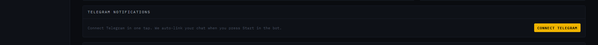
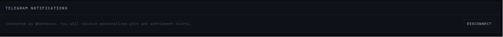
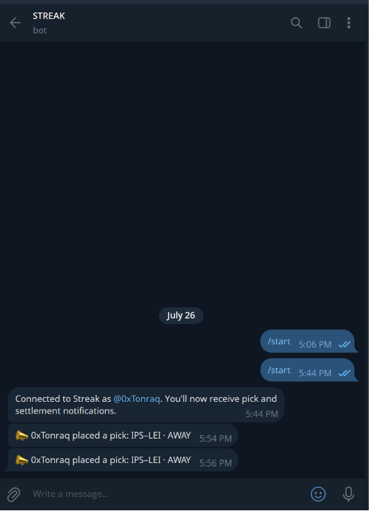
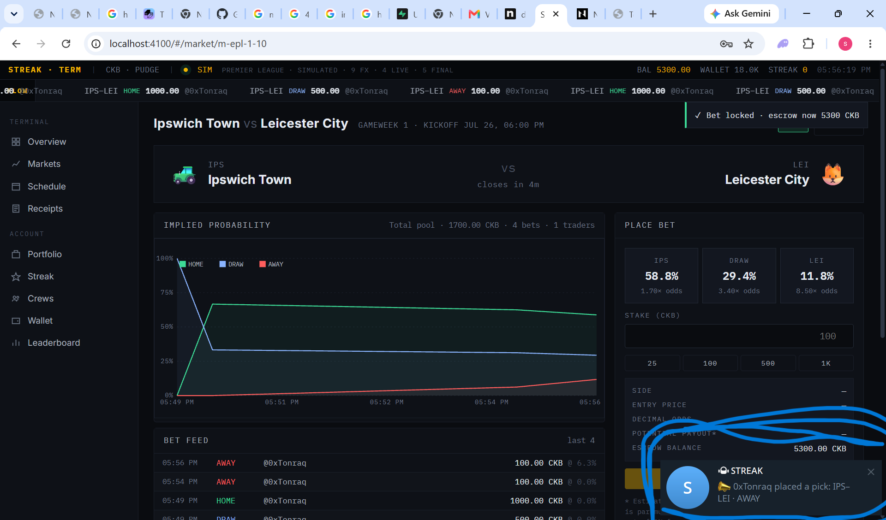

# Week 10: Streak Terminal - One-Tap Telegram, Personalized Alerts, and Supabase State

Week 9 made Streak runnable year-round by introducing a pluggable match provider
and added a social layer through crews and revive rebates. The next bottleneck
was operational: outcomes were verifiable and the in-app UX was fast, but users
still had to keep the app open to notice new picks and settlements.

Week 10 moves that signal to where users already are: Telegram. It adds a
pluggable notification provider, one-tap in-app Telegram linking, and
per-account delivery of pick/settlement events. In parallel, state persistence
is moved to Supabase (with local fallback), so bot links and notification
routing survive restarts and redeploys.

**Code:** [products/streak](../products/streak)
**Run:** `npm run streak` -> [http://localhost:4100](http://localhost:4100)

## The problem: notifications existed, but delivery did not

Before this week, Streak had no out-of-app alerting surface. A user could lock
a pick, have it settled, and miss everything unless they were actively watching
the dashboard. The system also had no per-user chat routing, so a single global
chat id would not scale beyond a solo demo.

Week 10 addresses both constraints:

- Notifications are now a provider interface, not hard-wired logic.
- Telegram linking is user-scoped and initiated from the Wallet screen.
- Notification state (chat id, username, link nonce map) is persisted in DB.
- Supabase becomes the primary store to make this durable across environments.

## Pluggable notifier architecture

The notification seam mirrors Week 9's oracle seam. The engine talks to an
interface in [products/streak/src/notifications/types.ts](../products/streak/src/notifications/types.ts),
while provider selection lives in
[products/streak/src/notifications/index.ts](../products/streak/src/notifications/index.ts).
Telegram is one implementation in
[products/streak/src/notifications/telegram.ts](../products/streak/src/notifications/telegram.ts).

This separation gives two practical wins:

- Delivery channels can change without touching market/game logic.
- Feature flags become environment-driven (`NOTIFY_PROVIDER=telegram`).

In the same way `MATCH_PROVIDER` decoupled data feeds, `NOTIFY_PROVIDER`
decouples alert transport.

## One-tap Telegram connect in Wallet

The Wallet screen now contains a dedicated Telegram card:

Tapping Connect launches the bot with a signed deep-link token. The user only
needs to press `Start` in Telegram; the webhook validates the token and binds
that Telegram chat to the logged-in Streak account.

Once linked, the card flips into connected state with account identity and a
disconnect action:

The app side is implemented in [products/streak/public/app.js](../products/streak/public/app.js),
with server routes and webhook handling in
[products/streak/src/server.ts](../products/streak/src/server.ts).

## Personalized Telegram delivery

After linking, notifications are sent to each user's own chat id, not a shared
global destination. The bot confirms linking and then pushes real trade events:

And for users actively browsing while trading, in-app web notifications can
surface the same event locally:

Under the hood, market and settlement events trigger async notification calls
from [products/streak/src/markets.ts](../products/streak/src/markets.ts) and
[products/streak/src/game.ts](../products/streak/src/game.ts).

## Supabase as the durable state layer

The week also moved runtime state to Supabase-backed persistence.

- [products/streak/src/store_supabase.ts](../products/streak/src/store_supabase.ts)
  adds load/save helpers and optional boot-time table creation.
- [products/streak/src/store.ts](../products/streak/src/store.ts) now uses
  Supabase when configured and falls back to local JSON storage if unavailable.
- Telegram linkage fields are now first-class in
  [products/streak/src/types.ts](../products/streak/src/types.ts), so they are
  preserved by regular read/write cycles.

This matters because chat routing data must be stable. If a restart loses
`telegramChatId` mappings, notifications silently degrade. Persisting centrally
eliminates that class of failure in normal operation.

## Reliability improvements made during rollout

While validating end-to-end behavior, two practical fixes landed:

- Pick notifications are no longer restricted to streak picks only; standard
  bets now emit alerts too.
- Telegram API response handling now checks non-2xx replies and logs bodies,
  making delivery failures diagnosable instead of silent.

These changes make "no message received" incidents observable and easier to
triage.

## What this week proved

- Pluggable boundaries scale beyond data feeds. The same design pattern used
  for providers in Week 9 applies cleanly to notifications in Week 10.
- UX friction dominates adoption. One-tap bot linking from Wallet is a much
  stronger onboarding path than manual chat id entry.
- Operational durability is product work. Moving state to Supabase is not
  cosmetic; it is what keeps identity and notification routing intact across
  process restarts.
- Observability is a feature. Explicit Telegram error logging turned a
  black-box delivery path into something you can debug quickly.

## Next

The natural follow-ups from this baseline are:

1. Add a second notifier (for example email or Discord) behind the same
   provider interface.
2. Add per-user notification preferences (pick-only, settlement-only, both).
3. Add delivery receipts/metrics in admin views to monitor alert success rates.