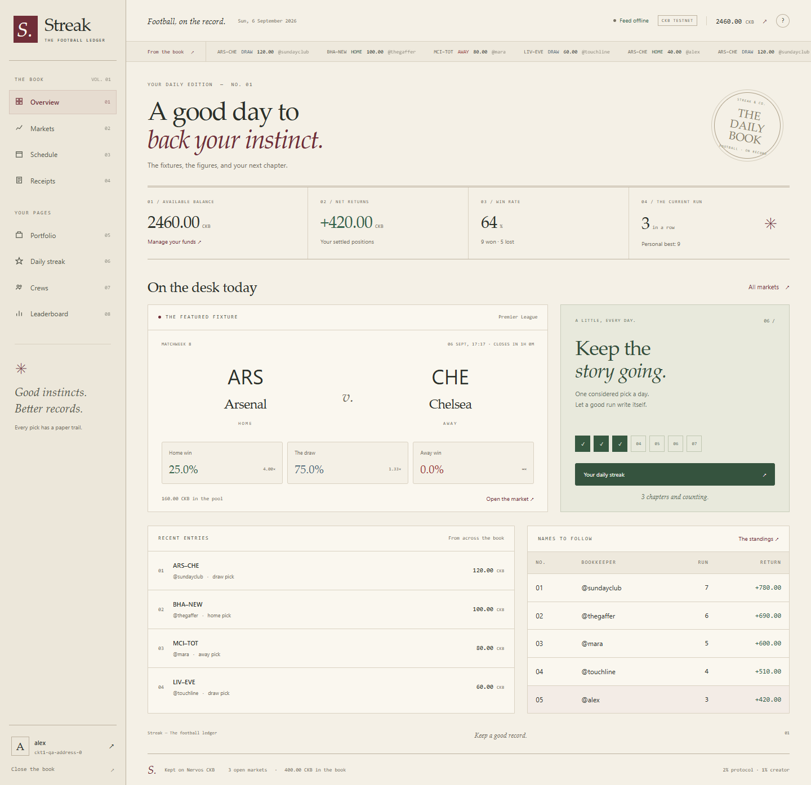
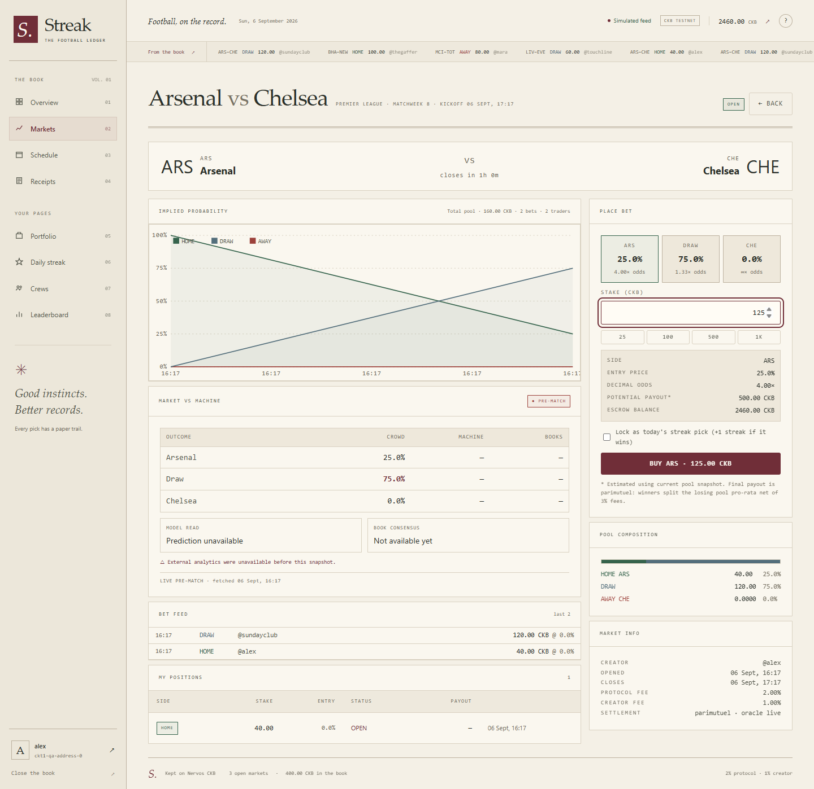
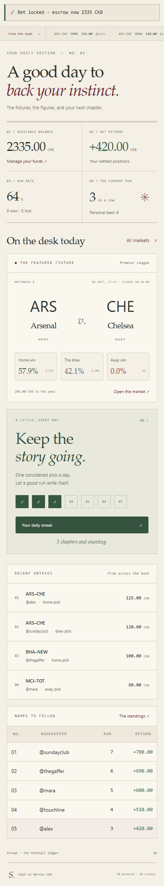
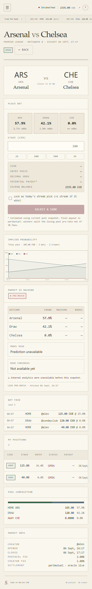
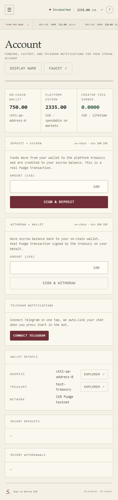

# Week 16: A Faster Streak, a Different Kind of Ledger

Week 15 added more useful information to Streak: crowd probabilities, machine
predictions, bookmaker consensus and frozen pre-match records. Week 16 deals
with the cost of that growing application. Opening a page could trigger a
fixture refresh, database writes and chain requests before the screen became
useful. Background refreshes also replaced parts of the interface the user
was still editing.

This week refactors those paths and gives Streak a new visual identity: **the
football ledger**. The result combines committed snapshots, independent
background work and a bookkeeper-inspired interface built around paper, ink
and readable records.

It also replaces the storage layer underneath all of it. Streak had been
keeping its entire state as a single JSON document in one database row, which
made the unit of every read and every write the whole ledger. That store is now
a relational schema, and the section below records what it cost and what it
changed.

**Code:** [products/streak](../products/streak)  
**Operational notes:** [PERFORMANCE.md](../products/streak/PERFORMANCE.md)  
**Preview gallery:** [24 desktop and mobile screenshots](assets/week-16/README.md)  
**Regression checks:** `npm run test:week16`

## The new visual direction

The graphite terminal, amber highlights and monospace-heavy presentation have
been replaced with warm parchment, oxblood actions, forest-green journal
panels and muted blue for neutral outcomes. Serif headings give the screens
the feel of a printed book; tabular numbers keep balances and odds readable.
The typefaces come from the operating system, so displaying a page no longer
depends on a font service.

The landing page introduces a custom book cover drawn entirely in CSS. The
application uses a book-spine navigation rail with numbered pages, an edition
date, a restrained activity strip and ruled tables. The overview now groups
available funds, net returns, win rate and the current run into four ledger
totals, followed by the featured fixture, a daily streak journal, recent
entries and standings. Account pages, receipts, dialogs and charts use the
same colors and typography.

Landing page and market detail previews

All screenshots in this report come from the isolated browser test server.
Names, fixtures, balances and receipts are synthetic test data, not a record
of live bets or actual payouts.

## What changed on mobile

| Area | Change |
| --- | --- |
| Navigation | The desktop spine becomes a drawer with keyboard focus handling, Escape-to-close behavior, an expanded-state label and active-page announcements. |
| Overview | The four totals become a two-column ledger. Featured fixtures and the streak journal stack vertically. |
| Market list | Narrow layouts retain the fixture and home/draw/away prices; secondary columns are omitted from this compact view and remain available in market detail. |
| Betting | The bet form appears before the chart and analytics. Outcome choices and quick amounts remain usable in compact grids. |
| Match header | Home and away teams stay in a compact three-column matchup instead of a tall, disconnected stack. |
| Charts and panels | Charts scale their height with their width. Grid children can shrink, long metadata wraps, and wide records scroll within their container. |
| Forms and dialogs | Labels are associated with inputs. Dialogs trap focus, close with Escape, restore the opener's focus and prevent interaction with the background. |
| Live updates | Polling preserves the selected outcome, typed stake and focused input. Hidden tabs stop doing refresh work. |
| Motion and touch | Reduced-motion preferences are respected, action elements use touch-friendly behavior, and the continuous ticker animation is removed. |
| Verification | The browser suite checks every main page at 1440-pixel desktop and 390-pixel phone widths, including horizontal-overflow assertions. |

| Overview | Bet form near the top | Account |
| :---: | :---: | :---: |
|  |  |  |

## Before-and-after benchmarks

The comparison uses the last committed implementation, `00d4b8f`, as **before**
and the refactored working tree as **after**. Each harness runs the versions
against the same synthetic state and explicitly controlled external-service
responses. Source fingerprints and individual timing samples accompany the
results. Measured runs are serialized to avoid the benchmark processes
competing with each other.

<!-- BENCHMARK_RESULTS -->

## The store migration: one JSON row to relational tables

Streak's persistence began as `data/db.json`, a single file loaded and rewritten
in full on every mutation. When the app needed hosted storage it kept that shape
and moved it behind an API, storing the whole `StreakDB` object in one `jsonb`
column. The hosted database was being used as a file host with an HTTP
interface, not as a database.

That works while the file is small. By week 16 the document had reached **3.1 MB**
and was growing by one market and one on-chain receipt for every settled fixture:

| Part of the blob | Rows | Size |
| --- | ---: | ---: |
| Settlement receipts | 1,436 | 1.49 MB |
| Markets resolved as void, each holding a published receipt | 1,431 | 941 KB |
| Matches already final | 1,436 | 398 KB |
| Price-tick history for archived markets | 1,441 | 377 KB |
| The actual working set: open markets, live fixtures, users, open positions | | **162 KB** |

Every read transferred all 3.1 MB regardless of what the endpoint needed, and
every write upserted all 3.1 MB regardless of how little had changed. Placing a
bet, which touches one user balance, one market pool and one new position,
rewrote the entire ledger. Fetching a single receipt payload did too.

The cost was not theoretical. With a 20-second settlement loop and a 1.5-second
read cache, the floor was roughly 13 GB of transfer per day before a single
browser connected. The hosting project exceeded its monthly egress allowance
and was restricted mid-week, taking the deployed service offline.

### What the schema looks like now

Thirteen tables ([001_schema.sql](../products/streak/scripts/sql/001_schema.sql)):
`users`, `matches`, `markets`, `bets`, `deposits`, `withdraws`, `receipts`,
`crews`, `telegram_links`, `renewal_txs`, the `market_history` and
`market_insights` side tables, and a small `streak_meta` singleton.

| Change | Result | Main files |
| --- | --- | --- |
| Write only what changed | Mutations are diffed against the last committed snapshot and sent as row upserts inside one transaction, instead of replacing the whole document. | [store_pg.ts](../products/streak/src/store_pg.ts) |
| Move receipts off the read path | `loadDB()` no longer materializes 1.49 MB of receipt payloads. The two endpoints that need them fetch by primary key. | [store.ts](../products/streak/src/store.ts), [server.ts](../products/streak/src/server.ts) |
| Never infer a delete from absence | Callers reassign whole collections, which a diffed write would otherwise read as mass deletion. Removals are named explicitly, and market deletion refuses anything holding bets or a receipt. | [store_pg.ts](../products/streak/src/store_pg.ts), [game.ts](../products/streak/src/game.ts) |
| Read a consistent snapshot | The twelve table reads run in one round trip under `REPEATABLE READ`, so a snapshot cannot pair a balance from before a commit with a position from after it. | [store_pg.ts](../products/streak/src/store_pg.ts) |
| Let the database enforce replay guards | `renewal_txs.tx_hash` and `deposits.tx_hash` are unique keys rather than arrays scanned in application code. | [001_schema.sql](../products/streak/scripts/sql/001_schema.sql) |
| Keep exact money | Amounts are `numeric(40,0)`, which the driver returns as a string, matching the shannon-string convention the code already used. No precision loss and no integer rounding. | [001_schema.sql](../products/streak/scripts/sql/001_schema.sql) |

| Operation | Before | After |
| --- | ---: | ---: |
| A read, any endpoint | 3.1 MB | 1.6 MB, cached, about 20 ms warm |
| A write, for example placing a bet | 3.1 MB upsert | only the changed rows |
| One receipt payload | 3.1 MB | about 1 KB by primary key |

### Migrating without losing a balance

The financial state was 10 users, 12 positions, 1,436 receipts and 53,980 CKB of
escrow claims. Escrow is the record of who owns what inside a single custodial
treasury; it exists nowhere else, so the migration was written to make silent
loss impossible rather than unlikely.

[migrate-to-tables.cjs](../products/streak/scripts/migrate-to-tables.cjs) is
insert-only and never modifies or deletes the source document, which remains a
rollback. It refuses to run against a source with orphaned references, duplicate
identifiers or amounts that do not parse as exact integers, because a malformed
amount must fail rather than default to zero. After loading, it re-materializes
the tables back into the original `StreakDB` shape and compares them record by
record, committing only when every field round-trips exactly and the escrow
total reconciles to the shannon.

Receipts needed one extra check. `jsonb` does not preserve key order, and each
receipt's hash is recorded on-chain. Reading a migrated payload back and
re-canonicalizing it reproduces the stored `payloadHash`, so on-chain receipt
verification survives the move unchanged.

Because the original project stayed restricted, the ledger was migrated to a
separate Postgres instance in the same region as the application server, and
the original document is retained for reconciliation once its quota resets.

## Refactor inventory

### Server requests and background work

| Refactor | Result | Main files |
| --- | --- | --- |
| Remove `syncMatches()` from page reads | Dashboard, markets, market detail, portfolio, crews and schedule no longer start a full sync/settlement pass before returning. | [server.ts](../products/streak/src/server.ts) |
| Coalesce background synchronization | Overlapping ticks share one operation. Optional insight warming runs independently of settlement. | [game.ts](../products/streak/src/game.ts) |
| Separate core data from optional remote data | Wallet and dashboard data return before chain-balance refresh; analytics and receipt verification hydrate separately. | [server.ts](../products/streak/src/server.ts), [chain.ts](../products/streak/src/chain.ts) |
| Share remote requests and bound display waits | Balance, provider-status, analytics and receipt requests reuse pending work and cached values. Optional balance and receipt waits are bounded; payment verification remains live. | [async-cache.ts](../products/streak/src/async-cache.ts) |
| Close markets in read models at kickoff | A delayed oracle does not make an expired market appear open. Bet placement still checks the deadline independently. | [markets.ts](../products/streak/src/markets.ts) |
| Reduce dashboard aggregation work | Independent selectors run together; match/user lookups use indexes; public-user ranking avoids unnecessary full leaderboard work. | [server.ts](../products/streak/src/server.ts), [game.ts](../products/streak/src/game.ts) |
| Cache and compress static responses | Reusable file buffers, gzip and ETags reduce repeat disk reads and transfer size; conditional requests can return 304 with no body. Larger JSON responses also use gzip. | [server.ts](../products/streak/src/server.ts) |
| Shorten startup's blocking path | Database and treasury readiness remain required; the server then listens while oracle and notification services initialize independently. | [server.ts](../products/streak/src/server.ts) |

### Persistence and the market engine

| Refactor | Result | Main files |
| --- | --- | --- |
| Coalesce database reads | Concurrent cold readers share one source fetch instead of repeatedly fetching the entire state. | [store.ts](../products/streak/src/store.ts) |
| Reuse committed immutable snapshots | Reads cannot mutate shared state. Queued writes start from a fresh cached snapshot when available instead of always fetching again. | [store.ts](../products/streak/src/store.ts) |
| Isolate mutation drafts | Changes become visible only after persistence succeeds; exceptions do not leak partially changed balances. | [store.ts](../products/streak/src/store.ts) |
| Guard stale reads and ambiguous writes | An older refresh cannot replace a newer commit. A write with an uncertain outcome invalidates cached state before subsequent work. | [store.ts](../products/streak/src/store.ts) |
| Skip unchanged writes | A mutation that produces no state change does not rewrite the database. | [store.ts](../products/streak/src/store.ts) |
| Strengthen local durability | Compact JSON is flushed to a temporary file before atomic rename. | [store.ts](../products/streak/src/store.ts) |
| Reduce Supabase overhead | Save requests return a minimal response rather than echoing the full state; remote operations have a configurable timeout. | [store_supabase.ts](../products/streak/src/store_supabase.ts) |
| Preserve one financial ledger during outages | A configured Supabase failure no longer silently switches writes to a divergent local file. Invalid local JSON is not overwritten with empty state. | [store.ts](../products/streak/src/store.ts) |
| Retain renewal replay history | Normalizing a database no longer drops previously used renewal transaction hashes. | [store.ts](../products/streak/src/store.ts) |
| Index settlement and view lookups | Reusable match/user/bet indexes replace repeated full-array scans in settlement, market summaries and portfolio views. | [markets.ts](../products/streak/src/markets.ts) |
| Maintain bettor counts incrementally | New bets update unique-bettor tracking without rebuilding the full bettor set for each bet. Principal-only winning positions retain their correct winning label. | [markets.ts](../products/streak/src/markets.ts) |
| Add isolated-state configuration | `STREAK_DATA_DIR` and `STREAK_DB_FILE` let tests use separate storage without touching the running application's database. | [config.ts](../products/streak/src/config.ts) |

### Payment correctness during faster concurrent requests

Withdrawals now reserve escrow durably before preparing an on-chain transfer.
A concurrent bet or second withdrawal cannot spend the same balance. The
signed transaction bytes and hash are saved before broadcasting so recovery
can resend the exact transaction instead of constructing another spend.

Preparation failures release their reservation. Abandoned reservations that
never recorded a hash can be recovered safely; active requests are excluded.
Once a transaction might have been broadcast, an uncertain response does not
automatically refund the escrow. Background reconciliation marks committed
transactions submitted. Permanently uncertain or rejected transactions can
still require operator investigation, as documented in the operational notes.

Deposit and renewal replay checks run inside serialized mutations, including
case-normalized transaction hashes and cross-purpose reuse checks. Concurrent
renewals cannot revive the same failed streak twice. Transient receipt RPC
failures remain pending instead of being presented as a verified mismatch.

These changes are in [wallet.ts](../products/streak/src/wallet.ts),
[chain.ts](../products/streak/src/chain.ts),
[game.ts](../products/streak/src/game.ts),
[types.ts](../products/streak/src/types.ts) and the store. Extra payment
durability is included in the benchmark timings; it is not bypassed to produce
a better number.

### Browser runtime and interaction handling

| Refactor | Result |
| --- | --- |
| Extract the small request/polling runtime | [runtime.js](../products/streak/public/runtime.js) owns shared API and refresh primitives without a new frontend framework. |
| Load the wallet SDK on connection intent | Reading the app no longer waits for the external connector's module graph. Connection controls can warm it on hover or focus. |
| Cache and deduplicate GET requests | An 8-second, 80-entry cache supports quick revisits; status metadata has a 30-second lifetime. Concurrent reads share a request; writes invalidate cached and in-flight reads across session changes. |
| Prefetch on intent and bound reads | Hover/focus can warm a destination's data while respecting data-saving preferences. GET requests have a 15-second deadline; writes are not automatically aborted or retried by this shared request layer. |
| Mount route targets immediately | Late responses cannot replace a newer route. Market-filter results also reject older requests that finish out of order. |
| Use completion-based polling | Polls do not overlap, pause in hidden tabs and cannot restart an abandoned route. |
| Update live market fields in place | Charts, pools, prices and feeds update without recreating the active bet form. Unchanged market lists avoid unnecessary table replacement. |
| Reduce repeated rendering work | Shared date/number formatters and reused chart paths reduce work. The header no longer replaces its contents every second. |
| Give actions immediate feedback | Busy states, background activity and result handling keep controls responsive and prevent completed work from navigating back to an old page. |
| Add keyboard semantics | Market rows and outcome tiles have keyboard actions; navigation announces the current page; mobile controls expose expanded state. |
| Clean the entry document | The duplicate HTML document is removed, remote fonts are removed, a local favicon is added and the loading state has an accessible status. |

The templates and interaction code remain in
[app.js](../products/streak/public/app.js). The new shared visual system is in
[styles.css](../products/streak/public/styles.css), with the entry document in
[index.html](../products/streak/public/index.html).

## Verification and remaining limits

The TypeScript build and all six regression suites passed after the refactor:
football-provider behavior, insights/provenance, store consistency, market
accounting, backend responsiveness/payment recovery and browser-runtime logic.
The backend suite deliberately blocks remote services and checks that local
pages still respond. It also tests concurrent spending, ambiguous persistence,
replay rejection, receipt failure handling and gzip/304 behavior.

The Playwright suite runs a real isolated HTTP server with synthetic fixtures.
It visits all main desktop and mobile routes, verifies that initial rendering
needs no external wallet or font request, checks rapid navigation and overflow,
waits through a live poll with a typed stake, reviews and confirms one test bet,
and opens a public receipt without authentication. The test never signs a real
transaction or changes a live account.

The architecture still assumes **one writer per database state**. Moving to a
relational schema did not change that: mutations are still serialized by an
in-process queue rather than by row-level locking, so this is not yet a
multi-instance deployment. Reads still materialize the full working set minus
receipts; narrowing them further needs a lifecycle window rather than a status
filter, because excluding finished fixtures would stop the settlement loop from
seeing a match that just ended. The receipt gallery currently returns its most
recent 200 entries and needs pagination to show the full archive. Fixture freshness follows
the background sync cadence, optional data can briefly show its last successful
value, and the app still needs a working external feed and CKB network for live
results and payments. Faster page rendering does not shorten wallet approval,
network propagation or block confirmation.

## Reproduce the checks

<!-- REPRODUCTION_COMMANDS -->

The store migration has its own checks. `npm run test:store:pg` exercises the
relational store against a real database, covering the archive split, partial
writes, the refusal to infer deletes and rollback on a rejected write, and skips
when no database is reachable. Running `migrate-to-tables.cjs` without `--apply`
performs the full integrity check, money reconciliation and round-trip
comparison, then rolls back without writing.

The report records one measured run, with raw samples kept alongside the
screenshots. Rerunning the harnesses may produce different timings because of
CPU load, filesystem behavior, browser scheduling and timer granularity. The
comparison scripts isolate the old code without checking out or resetting the
working tree and block external network requests during the measurements.
