# Week 17: Streak Matchday — From Pick to Final Whistle

Week 16 made Streak faster and moved its state to PostgreSQL. This week gives
people a reason to stay with a match after making their pick: a Matchday centre
with a live timeline, starting lineups, match statistics and a personal pick
tracker that leads into the existing settlement receipt.

It also completes the visual change prompted by feedback on the beige interface.
The product now uses graphite surfaces, coral actions, glass panels and clearer
sports layouts across desktop and mobile.

**Code:** [products/streak](../products/streak) ·
**Provider integration:** [football.ts](../products/streak/src/providers/football.ts) ·
**Live context:** [matchday.ts](../products/streak/src/matchday.ts) ·
**Screens:** [matchday.js](../products/streak/public/matchday.js)

## What you can do

Open **Matchday** from the desktop navigation or mobile dock. The match list puts
live fixtures first, with filters for all matches, live, upcoming and finished.
The existing market page also has a **Follow match** link.

Inside a match, the scoreboard keeps the score, provider-reported match minute,
competition and venue visible while scrolling. Three tabs organise the detail:

- **Timeline:** goals, cards, substitutions and VAR events, newest first.
  Added time is preserved. Events are replaced on refresh, so corrections can
  remove an earlier event instead of leaving a duplicate or cancelled goal behind.
- **Lineups:** each team's formation, starting XI, coach and substitutes.
  The pitch uses the provider's player grid. If positions are missing, a roster
  appears instead of an invented formation. Incomplete teams are labelled partial.
- **Stats:** possession, shots on target, total shots, corners, fouls and yellow
  cards. Home and away values use coral and lavender comparison bars. Zero remains
  zero; missing values appear as a dash.

Your pick tracker shows the selected outcome, stake and settlement state. Multiple
picks on the same outcome are combined for display, with their count shown.
Payouts appear only when the existing market engine has settled the bet. Once a
receipt reference is published, **View settlement receipt** opens the existing
shareable verification page.

The compact **Market vs Machine** panel keeps the pre-match crowd and model
comparison nearby. A frozen forecast stays frozen as the live match develops.

## The new visual direction

The supplied [Chessdict reference](https://www.figma.com/design/Yttwy5KhaSc7QWRjRPNil5/Chessdict?node-id=377-2947)
informed the warm glows, translucent surfaces, rounded navigation and mobile
card structure. Streak's football scoreboard, pitch, event timeline and pick
tracker are original compositions for this product.

The redesign also covers the landing page and existing app screens: a new hero
and interactive example slip, a floating mobile dock, a capsule desktop header,
clearer market cards and coral calls to action. The example slip is labelled
illustrative and never places a bet.

Desktop places the match content beside the pick tracker and pre-match analysis.
Mobile moves a compact pick card above the tabs, with expandable settlement
details. Tabs support arrow keys, Home and End. Selected tabs, selected team and
keyboard focus survive refreshes. The interface uses local CSS and system fonts;
reading it does not require downloading the wallet SDK.

## Screenshots

These are actual browser captures of the implemented UI at **1440 px desktop**
and **390 px mobile**. They use an isolated test database and **synthetic match
coverage** so live, delayed and settled states can be reproduced. The Arsenal–
Chelsea score, lineups, stakes and receipt transactions shown are illustrative;
they are not evidence of that fixture occurring or a new on-chain transaction.
The separate real-provider check is documented below.

### Updated interface

| Desktop | Mobile |
| --- | --- |
| [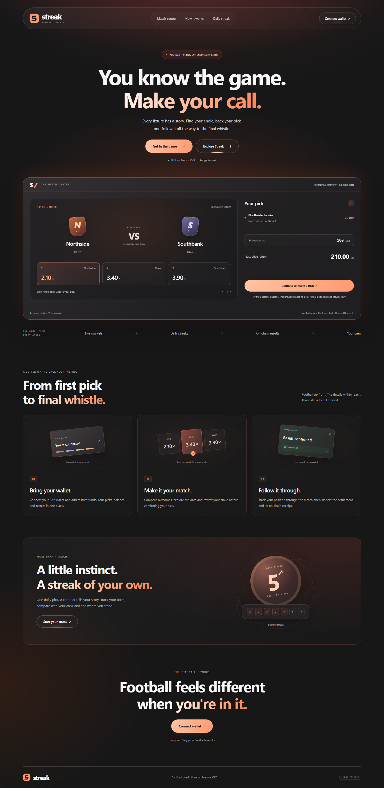](assets/week-17/landing-desktop.png) | [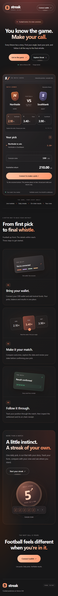](assets/week-17/landing-mobile.png) |
| [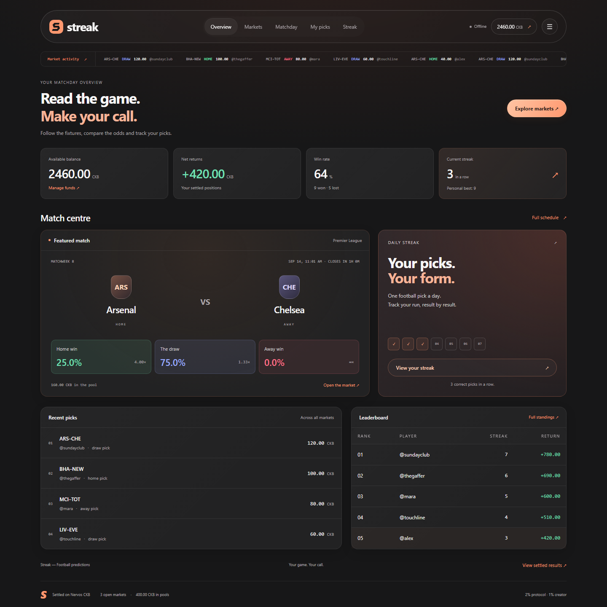](assets/week-17/overview-desktop.png) | [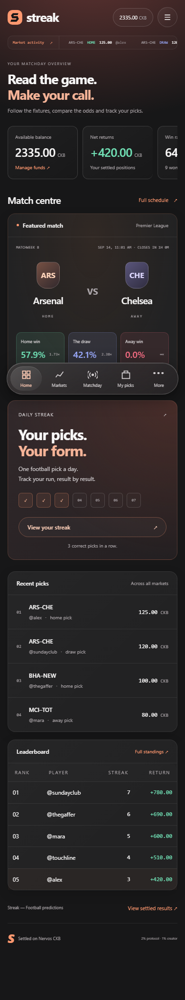](assets/week-17/overview-mobile.png) |
| [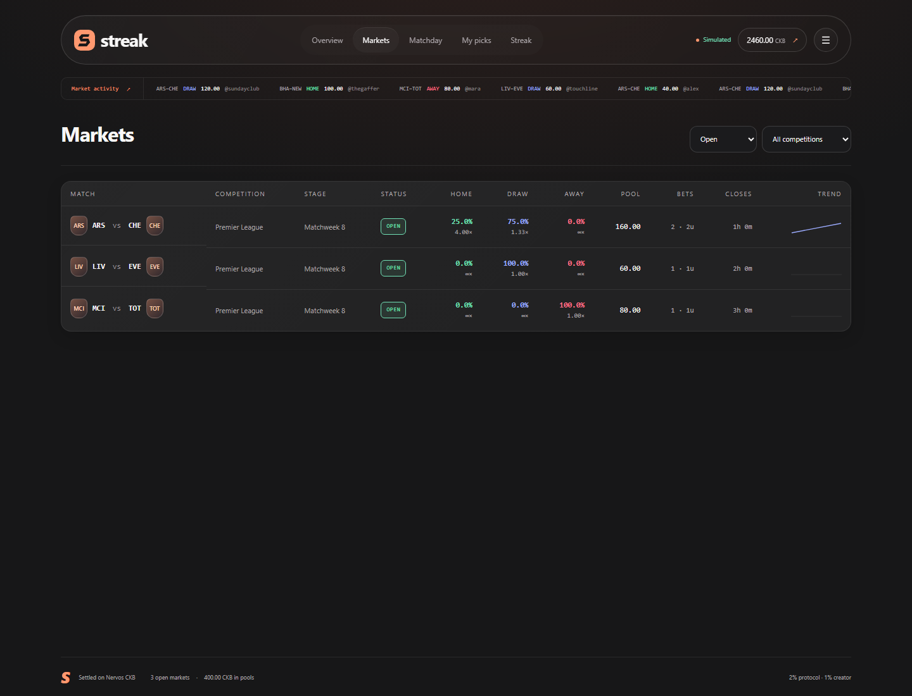](assets/week-17/markets-desktop.png) | [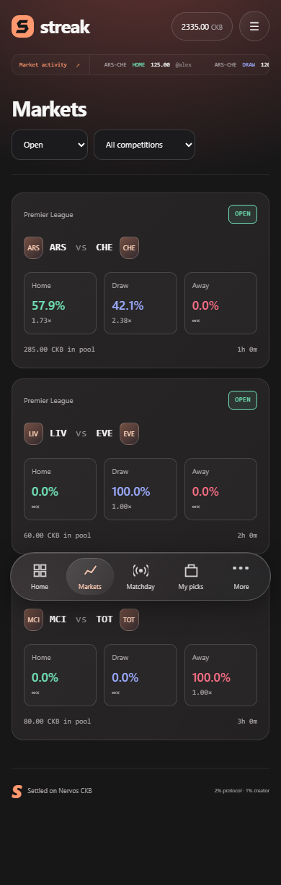](assets/week-17/markets-mobile.png) |

### Matchday features

| Desktop | Mobile |
| --- | --- |
| [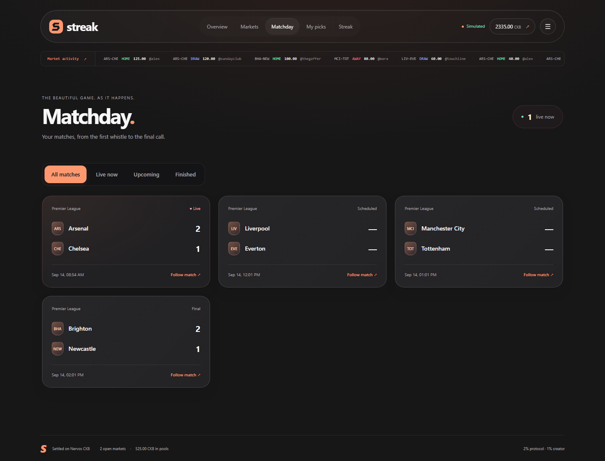](assets/week-17/matchday-lobby-desktop.png) | [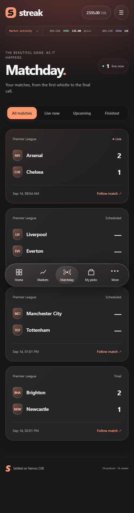](assets/week-17/matchday-lobby-mobile.png) |
| [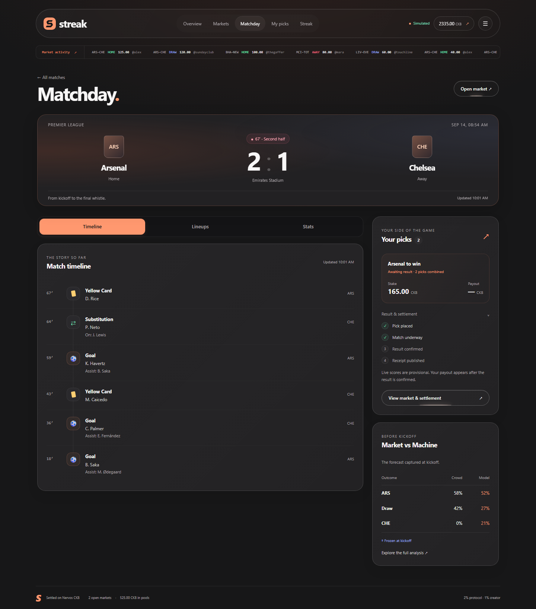](assets/week-17/matchday-timeline-desktop.png) | [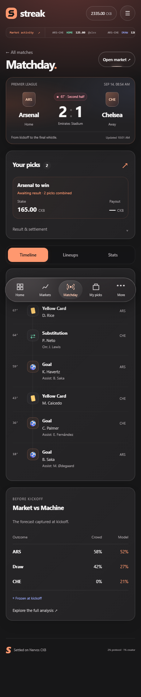](assets/week-17/matchday-timeline-mobile.png) |
| [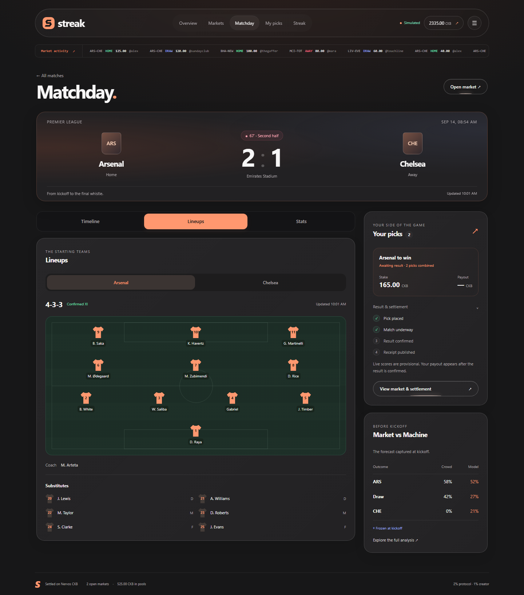](assets/week-17/matchday-lineups-desktop.png) | [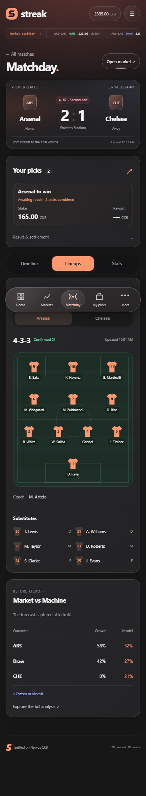](assets/week-17/matchday-lineups-mobile.png) |
| [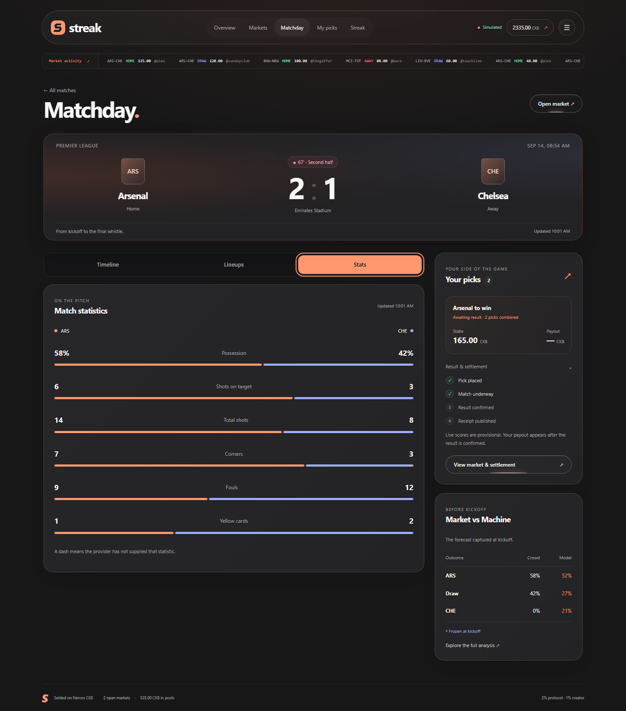](assets/week-17/matchday-stats-desktop.png) | [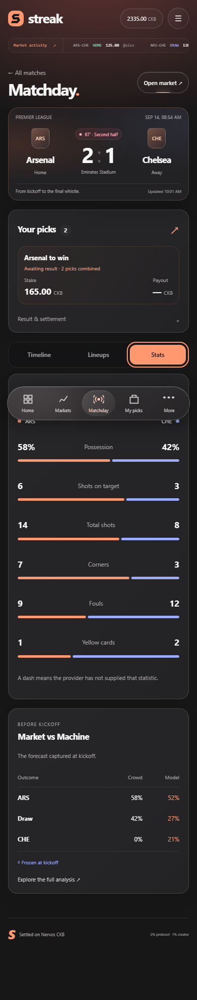](assets/week-17/matchday-stats-mobile.png) |
| [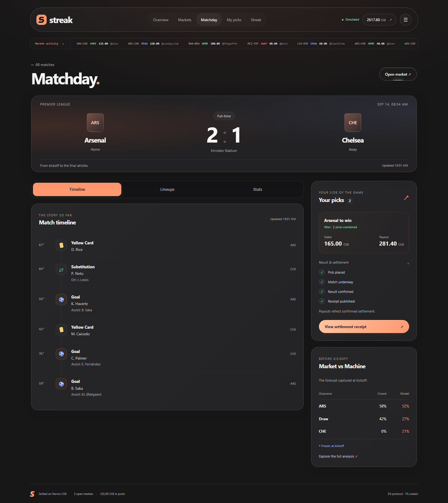](assets/week-17/matchday-settled-desktop.png) | [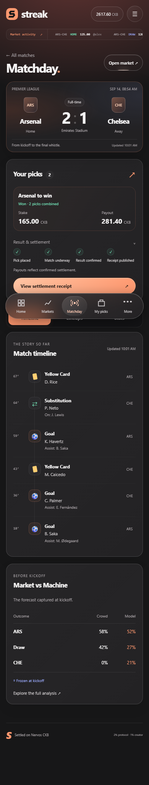](assets/week-17/matchday-settled-mobile.png) |

The [delayed-feed mobile capture](assets/week-17/matchday-delayed-mobile.png)
shows retained match data with an explicit delay message.

## Keeping live data responsive

`GET /api/markets/:id/matchday` returns the last available context immediately
while a shared background request refreshes it. The first response can contain
loading sections; the browser checks again without blocking navigation. Reads
do not call the settlement loop or write to the financial store.

The API-Football adapter uses `/fixtures`, `/fixtures/events`,
`/fixtures/lineups` and `/fixtures/statistics`, after checking league coverage.
This follows the provider's [documented endpoint model](https://www.api-football.com/news/post/how-to-get-started-with-api-football-the-complete-beginners-guide).

| Data | Cache / refresh rule |
| --- | --- |
| Competition coverage | Existing shared 24-hour cache |
| Matchday aggregate | 15 seconds; served while refreshing |
| Score and events during play | 20 seconds per fixture |
| Live match statistics | 60 seconds |
| Lineups before/during play | 5 minutes |
| Finished score, events and stats | 5 minutes |
| Finished lineups | 1 hour |
| Failed section request | 20-second retry backoff |

These are cache intervals, not guarantees about the provider's delivery latency.
The browser polls after the previous request completes and pauses when hidden.
Scheduled matches more than 90 minutes away spend no detail quota. Before kickoff,
events and statistics wait while the scoreboard and lineups can load. Lifecycle
changes use separate cache keys so kickoff and finalisation invalidate earlier
states immediately.

Sections distinguish loading, scheduled, unavailable, unsupported coverage,
empty, ready and stale. Failures retain the last successful data and timestamp.
Freshness checks also label an old response while a replacement is still pending.
Request sharing and bounded caches limit duplicate work and memory growth.

## Protecting the settlement boundary

Live context is deliberately observational. A provider's event list or displayed
score cannot directly settle a market. The existing oracle confirmation rules,
betting cutoff, payout engine and receipt format remain authoritative.

Knockout games can have different regulation and extra-time scores. Matchday
preserves both and labels the regulation score when extra time or penalties are
reported. The football market continues to settle on its existing 90-minute rules.

No new contract or custody mechanism was introduced this week. Testnet deposits
still use the existing custodial treasury, and the on-chain receipt remains the
verification record for settlement. Live Matchday context is kept in memory;
it is not a permanent replay archive and is re-fetched after restart.

## Validation

The following checks were run on 14 September 2026:

| Check | Result |
| --- | --- |
| TypeScript build | Passed |
| Football provider mappings and terminal safety | Passed |
| Market vs Machine and immutable snapshot provenance | Passed |
| New Matchday suite | Passed |
| Store durability, rollback, races and replay protection | Passed |
| Market settlement, fees, refunds and concurrent bets | Passed |
| Backend HTTP and payment regressions | Passed |
| Client runtime suite | 6 passed |
| Playwright browser suite | Passed |
| PostgreSQL-specific suite | Skipped: local test database on port 55432 unavailable |

The new unit tests cover added time, duplicate and corrected events, partial
lineups, missing grid positions, null versus zero statistics, unsupported
coverage, shared concurrent requests, separate cache intervals, failure backoff,
stale timestamps, kickoff invalidation and unchanged stored match input.

The backend check holds a provider response unresolved and proves the Matchday
endpoint still responds immediately; concurrent callers share one request.
Unknown markets return 404, and viewing Matchday does not start settlement.

Browser checks exercise all app routes on desktop and mobile, plus key Matchday
views at **320, 768 and 1024 px** without horizontal overflow. They cover keyboard
tabs, both teams' XIs, tab/team/focus preservation through polling, delayed data,
the frozen forecast hash, real local settlement and navigation to the receipt.
They also retain the existing checks for bet confirmation, stake-field
preservation, navigation races and unauthenticated receipt access. External
server requests are blocked and all financial actions use temporary test state.

### Real-provider check

At **08:55 UTC on 14 September 2026**, the read-only integration check selected
API-Football fixture **1557404**, Manchester United vs Manchester City, from the
configured league's latest completed fixture. It returned:

- a ready full-time scoreboard;
- 11 match events;
- two lineups, each with 11 starters and 9 substitutes;
- values for all six supported statistics.

The sanitised [provider evidence](assets/week-17/matchday-live-validation.json)
records the exact response summary. This validates a real completed-fixture
integration; it does not measure delivery latency during a match. The check made
read-only provider requests and did not access the app database or broadcast a
transaction.

## Reproduce

```bash
cd products/streak
npm run build
npm test
npm run test:browser
```

Screenshots are written to `products/streak/data/qa`. The synthetic coverage is
defined in [matchday.cjs](../products/streak/scripts/fixtures/matchday.cjs).

For the optional real-provider check, configure the existing `API_SPORTS_KEY`,
`FOOTBALL_LEAGUE_IDS` and `FOOTBALL_SEASON`, then run:

```bash
npm run check:matchday:live
```

It consumes a small number of provider requests and writes a sanitised summary to
`data/qa/matchday-live-validation.json`. Normal tests do not require API access.
