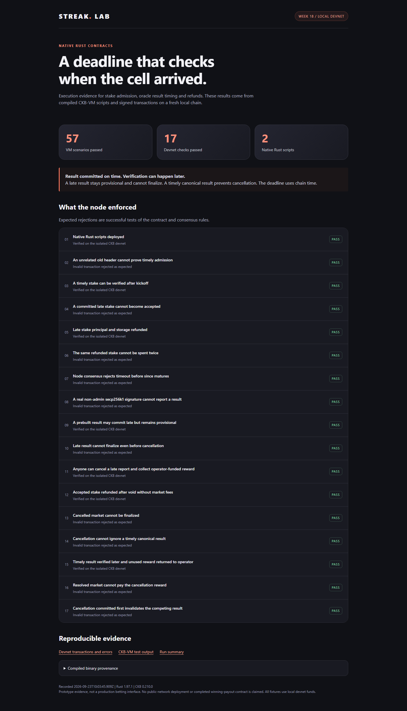
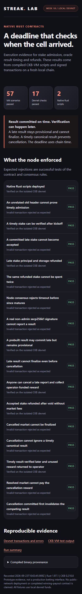

# Week 18: Rust Contracts for Admission, Deadlines and Refunds

Week 17 added Matchday and refreshed Streak's interface. This week turns the
contract-design feedback into a working Rust experiment: verifying when stakes
and football results reached CKB, rejecting late submissions, and returning
funds through script-enforced refund paths.

The result is **two native Rust scripts, 57 passing CKB-VM scenarios and 17
passing local-devnet checks**. This is an isolated prototype. Streak's deployed
application still uses its existing custodial treasury.

**Code:** [contract lab](../src/week18/contract-lab)

**Schemas and transaction rules:** [lab README](../src/week18/contract-lab/README.md)

**Design decisions:** [contract scope](../products/streak/CONTRACT_SCOPE.md)

## What changed

- A market type script validates admin-authorized creation, a provisional
  oracle result, permissionless verification and timeout cancellation.
- A stake type validates funded Pending cells, admission as Accepted cells and
  owner-bound refunds. These are two modes of the same protocol binary.
- A separate guard lock requires the exact pinned type script on every spent
  protocol cell. The type script controls the permitted movement of its funds.
- A JavaScript transaction runner uses CCC to sign real secp256k1
  transactions against a fresh local CKB node. No application key or balance is
  loaded.
- Root npm commands build, test, run the devnet and publish the evidence page.

The prototype lives separately from the week-13 JavaScript hash-lock. It compiles
to native RISC-V and runs directly in CKB-VM.

## Checking the actual cutoff

The reviewed crowdfunding example compares a deadline with an input's `since`.
The follow-up feedback confirmed the limitation: `since` establishes the
earliest allowed inclusion, so a pre-deadline value does not prevent a
transaction from arriving later. [CKB since specification](https://github.com/nervosnetwork/rfcs/blob/master/rfcs/0017-tx-valid-since/0017-tx-valid-since.md)

The new experiment uses two transactions. The first creates a Pending stake.
The second consumes it and loads the header of the block that actually created
that input, using `Source::GroupInput`. A timestamp strictly before kickoff makes
the stake eligible for admission. A timestamp at or after kickoff makes it
ineligible and refundable. An unrelated old header cannot substitute for its
creation header. [CKB header dependencies](https://github.com/nervosnetwork/rfcs/blob/master/rfcs/0022-transaction-structure/0022-transaction-structure.md#header-deps)

The devnet run admitted a timely stake after kickoff, rejected a late stake and
refunded the late stake's full capacity. The invalid deposit transaction was
not erased from the chain; its later admission was rejected.

## Keeping results and cancellation consistent

The admin records an outcome by consuming the canonical Open market cell and
creating ResultPending. Anyone can then verify that cell's creation time.
The outcome can become Resolved only if its block timestamp is at or after
kickoff and strictly before kickoff plus six hours.

This makes the rule precise: **the result must be committed before the deadline;
its verification can occur later**. This refines the earlier wording about
finalizing before the deadline. It remains a prototype policy for review.

| Market state | Allowed next step |
| --- | --- |
| Open | Admin records one provisional result, or anyone voids after timeout |
| ResultPending, created within the result window | Anyone verifies it as Resolved; cancellation is rejected |
| ResultPending, created outside the window | Anyone voids after timeout; resolution is rejected |
| Resolved or Void | No further market transition in this prototype |

A result cannot hide in a separate cell that cancellation overlooks. Both paths
must consume the canonical market state. The tests exercise both orderings:
late reporting first still cannot resolve, while cancellation first invalidates
the competing transaction's spent input.

The timeout checks an absolute timestamp `since`, rounded up to seconds. Node
consensus enforces its maturity against median chain time. Submission eligibility
uses the creation header's timestamp in milliseconds. Neither is a promise of
exact wall-clock UTC timing. The oracle remains trusted for football truth.

## Refunds and the cancellation reward

The operator funds a reward separately from user stake cells. A valid void
transaction pays that reward and updates market state atomically. Successful
verification of a timely result returns the unused reward to the operator.
The reward encourages monitoring; the creation-header rule prevents a late
result from resolving.

Refunds return the whole stake cell to its pinned owner, including its storage
capacity. No protocol or creator fee is deducted. Another wallet input pays
network fees and proves owner authorization.

The fixtures deliberately overfund storage: each 800 CKB stake cell contains
100 CKB principal plus 700 CKB additional capacity. The demonstrated refund is
800 CKB, not an 800 CKB bet. The separately funded market cell contains an
illustrative 100 CKB cancellation reward. These are local test values, not
production minimums or fee recommendations.

## Validation

Checks were run on 23 September 2026.

| Check | Result |
| --- | --- |
| Native RISC-V build, Rust 1.97.1 and ckb-std 1.1.0 | Passed |
| Rust formatting | Passed |
| CKB-VM suite | 10 test functions, 57 scenarios passed |
| CKB 0.210.0 local devnet | 17 checks passed |
| Root TypeScript build | Passed |
| Streak TypeScript build | Passed |
| Existing Streak regression suites | Passed, except the separate PostgreSQL suite skipped below |
| PostgreSQL-specific regression suite | Skipped: no local test database at port 55432 |
| Evidence page at 1440 px and 390 px | Captured; all 17 results present and no horizontal overflow |

The VM cases include exact deadline boundaries, missing and unrelated headers,
wrong owners and admins, malformed terms, arithmetic overflow, unbacked stakes,
changed outcomes, redirected refunds, capacity skimming, invalid since flags,
repeated finalization, underfunded or dust-sized cancellation rewards, and two
claims trying to count one refund output.

The devnet adds actual signature verification, committed creation headers,
consensus rejection of an immature timeout, and spent-input rejection after
refund or cancellation. Its blocks use historical timestamps to span the
six-hour interval quickly. The mining RPC follows CKB's verified block-processing
path; no verification-bypass RPC is used. The test node shuts down afterwards.

Successful VM fixtures consumed **40,558 to 68,205 cycles**, including their
mock wallet locks. This is a fixture measurement, not a production transaction
cost or throughput benchmark. The devnet uses real signature locks separately.

The initial compiler run exposed unsupported atomic instructions. The build now
uses `passes=lower-atomic`, following the current
[ckb-std guidance](https://github.com/nervosnetwork/ckb-std#upgrading-issues).

## Evidence and screenshots

These browser captures show a static page generated from the completed test
records. They are not screenshots of a new production betting screen.

| Desktop evidence | Mobile evidence |
| --- | --- |
| [](assets/week-18/contract-lab-desktop.png) | [](assets/week-18/contract-lab-mobile.png) |

- [Devnet transaction hashes, expected errors and binary hashes](assets/week-18/devnet.json)
- [Complete VM test output](assets/week-18/vm-tests.txt)
- [Machine-readable summary](assets/week-18/summary.json)
- [Standalone evidence page](assets/week-18/index.html), which can be opened locally

The transaction hashes belong to this local chain, so they are not links to a
public testnet explorer. The evidence exporter checks that the recorded binary
hashes still match the built scripts.

## What remains before a betting protocol

Accepted stake cells are admission receipts. Fungible outcome shares, complete
pool accounting and winning redemption are not implemented yet. A production
design must account for every eligible stake before freezing payout totals.

The proposed pool shards still use sequential round-robin routing in the
transaction builder. This week's independent stake cells isolate the timing
experiment; they do not implement shard aggregation or benchmark contention.

Market identity and authority are pinned per market. A production deployment
must also define its approved admin catalogue, oracle correction policy,
confirmation/finality policy, storage recovery and terminal cleanup. Terminal
market storage and winning stake funds have no general exit in this deliberately
incomplete experiment. It must not hold real funds.

Gnosis outcome positions, OpenZeppelin authorization conventions and ERC-4626
accounting conventions remain references for the wider design. These Rust
scripts do not claim ERC compatibility or reuse EVM bytecode. No audit, mainnet
readiness, public-network deployment or migration of existing balances is claimed.

## Reproduce

From the repository root, with the prerequisites in the lab README:

```bash
npm run test:week18
npm run devnet:week18
npm run evidence:week18
```

On Windows the first two commands use the default WSL distribution. The evidence
command uses the Streak package's Playwright installation for browser captures.
