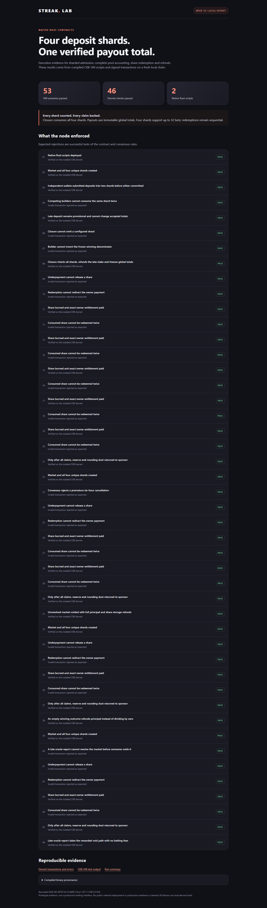
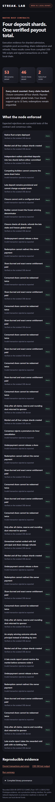

# Week 19: sharded pools, backed shares and payouts

This week I extended the Rust contract lab from admission and deadline checks into a complete, bounded parimutuel market. The local flow now creates a market, accepts stakes across four shards, checks the oracle report, closes every shard, and pays winnings or refunds through redeemable share cells.

The main issue was complete accounting. Splitting deposits across several cells helps with the hot-cell problem, but the contract still needs to prove that settlement counted every accepted bet. It also needs enough accessible backing for each payout. This version solves that within a deliberately small limit of four shards and eight bets per shard.

This is an isolated prototype. The existing Streak app still uses its custodial backend. There was no public testnet or mainnet deployment, treasury migration, or new production UI this week.

## What changed

| Area | Implemented behavior |
| --- | --- |
| Market creation | Admin-authorized creation of one control cell and exactly four uniquely numbered shards |
| Deposit routing | Sequential round-robin selection, local pending reservations, and a tested bounded retry helper |
| Admission | A provisional bet must have committed before kickoff; subsequent shard updates verify its creation header |
| Complete accounting | Closure consumes every shard in order and derives totals from the preserved records |
| Shares | Closure creates one backed, owner-bound receipt per accepted bet |
| Oracle timing | A result report must commit between kickoff and the six-hour deadline; verification may happen later |
| Settlement | One payout cell holds consolidated backing and immutable Home/Draw/Away totals |
| Redemption | Exact owner payment, receipt destruction and a cleared claim bit in the same transaction |
| Void | Principal and receipt storage refunded, no betting fees, and an operator-funded cancellation reward |
| Cleanup | Reserve and rounding dust return to the sponsor only after every receipt is redeemed |

The same native Rust type script validates the control, shard, payout and receipt roles. A separate guard lock prevents spending a protected cell without its pinned type script. Transactions have prescribed input and output positions so one payment cannot be reused to satisfy several obligations.

## Addressing the hot-cell feedback

Deposits consume one shard and read the open control cell as a dependency. The script checks the transaction; the off-chain builder chooses which shard to use. There is no shared on-chain routing counter.

The devnet test submitted two independently signed transactions from different wallets into different shards before either committed. Both were accepted and committed. A competing transaction that tried to spend an already consumed shard was rejected. This demonstrates the intended concurrency, but it is not a throughput benchmark.

The builder rotates through shard numbers in sequence. Local reservations prevent it from choosing its own busy shard. Another builder can still collide with it. The retry helper refreshes state and rebuilds after recognized conflicts; invalid signatures and other failures are not retried automatically. The helper is tested independently and is not integrated with Streak's production transaction queue.

## How all stakes get counted

Each shard carries an append-only list of accepted bet records and at most one provisional record. A new deposit must first verify that provisional record's actual creation block. If it arrived before kickoff, it joins the accepted list. Otherwise, the previous owner must receive principal and reserved share storage back in that transaction.

Closure consumes the control cell and shards 0, 1, 2 and 3. It checks any remaining provisional records, refunds late bets, computes the totals itself, and creates exactly the corresponding receipt cells. No indexer-supplied total is trusted. An omitted shard, duplicate shard, changed denominator or fabricated receipt fails validation.

There is an intentional difference from the original idea of minting a transferable token at deposit time: the deposit first creates an on-chain ownership record inside its shard. The separate share cell is minted at closure. This makes the complete claim set directly checkable in this version. Immediate issuance and transferable shares remain design work.

## Payouts and storage

The original winning total stays fixed even as receipts are redeemed. For winning principal `W`, losing principal `L`, and a winning bet `s`:

```text
protocol fee = floor(L / 50)
creator fee = floor(L / 100)
distributable profit = L - protocol fee - creator fee
payout = s + floor(s * distributable profit / W)
```

For example, a 100 CKB winning bet in a 1,000 CKB winning pool against 2,000 CKB of losing bets receives 294 CKB. Storage is accounted for separately. The calculator test verifies this example, while VM and devnet tests check actual payment outputs.

Every bet supplies an additional 500 CKB for its eventual receipt cell. Winners receive that storage alongside winnings. Losers receive their storage back. A void or empty-winning market returns principal plus storage, without betting fees. The lab minimum principal is 100 CKB.

The operator initially supplies 5,000 CKB across the control and shard cells. Successful settlement with losing stakes also uses 100 CKB of this reserve for each fee output's storage. These subsidies are not deducted from the betting principal. Cancellation instead pays a 100 CKB keeper reward from the reserve. Remaining reserve and rounding dust are recoverable after every claim has been processed. These amounts make the prototype easy to inspect; they are not optimized production parameters.

Protocol and creator beneficiary hashes are immutable market terms and use different wallets in the devnet fixtures. This does not settle the product question of who should receive the creator fee under admin-created markets.

## Test results

| Check | Result |
| --- | --- |
| Rust CKB-VM | 53 scenarios passed in 7 test functions |
| Signed local CKB devnet | 46 checks passed |
| Routing and accounting | 4 tests passed, including 1,000 deterministic portfolios |
| Maximum market fixture | All 32 share cells created and the complete fee calculation verified in the VM |
| Root TypeScript build | Passed |

The VM tests cover unauthorized creation and reporting, malformed shard sets, changed accepted records, underfunded deposits, missing headers, late stake refunds, forged receipts, fee diversion, altered totals, underpayments, stolen recipients, repeated claims, early cleanup and type removal.

The devnet uses ordinary signed transactions and normal CKB validation. It covers complete winning payouts, reverse claim order, unresolved cancellation, an empty winning outcome, and a report committed after the six-hour deadline. That late report cannot finalize even before someone voids the market. Its subsequent void returns the bet and pays the cancellation reward.

Successful VM fixtures used 57,107 to 705,866 cycles. Those figures include the 32-share closure fixture but use mock wallet locks. They are not production fee estimates or throughput measurements. The devnet uses real secp256k1 signatures. Its mining clock advances locally so timeout cases do not require waiting six hours.

The 1,000-portfolio accounting test checks that payouts plus fees never exceed the available principal, reverse-order claims remain funded, and rounding leaves less than one shannon per receipt on average. It also checks full-principal void refunds. This is deterministic test coverage, not a formal proof or audit.

## Evidence

- [Run summary](assets/week-19/summary.json)
- [Devnet transactions and expected rejection details](assets/week-19/devnet.json)
- [VM output](assets/week-19/vm-tests.txt)
- [Routing and accounting output](assets/week-19/accounting-tests.txt)
- [Evidence page](assets/week-19/index.html)
- [Contract source and run instructions](../src/week19/contract-lab/README.md)

The screenshots show a generated test-evidence page, not a new betting interface. The page checks the completed run and deployed binary hashes before rendering. Captures use desktop and mobile viewports, with overflow checks.





## EVM references

I used [Gnosis Conditional Tokens](https://github.com/gnosis/conditional-tokens-contracts/blob/master/contracts/ConditionalTokens.sol) as a reference for outcome positions, oracle resolution and burning positions during redemption. This implementation does not copy its complete-set collateral splitting or ERC-1155 transfer model.

[ERC-4626](https://eips.ethereum.org/EIPS/eip-4626) informed the separation of deposited assets, shares, redemption and rounding. This is a three-outcome parimutuel market rather than an ERC-4626 vault. [OpenZeppelin's access-control patterns](https://docs.openzeppelin.com/contracts/5.x/access-control) informed the privileged operations, but this version uses a single pinned admin rather than separate deployed roles. These are design references, not imported Solidity modules or claims of ERC compatibility.

## What needs review next

The prototype improves deposit concurrency, but consolidates funds into one payout cell. Redemptions are therefore sequential. The 32-bet limit and atomic closure keep accounting reviewable, but are not sufficient for a busy production market.

The oracle remains trusted for football results. There is no dispute or correction flow. The market pins an admin per instance, so clients must also pin the approved admin and validate fee beneficiary configuration. Deadline enforcement uses block creation timestamps and consensus timeout rules, not an exact wall-clock upper bound at transaction submission.

Before integration, I would review immediate share issuance, scalable closure and payout funding, fee beneficiaries, supported wallet locks, capacity costs, code deployment permanence, and keeper/indexer recovery. The current receipts cannot transfer or split, and late deposits may wait for another shard update or closure to be refunded.

## Reproduce

```sh
npm run test:week19
npm run devnet:week19
npm run evidence:week19
npm run build
```

The lab pins Rust 1.97.1, `ckb-std` 1.1.0, `ckb-testtool` 1.1.1 and CKB 0.210.0. Its scripts and local artifacts are isolated from Week 18 and the application wallet.
