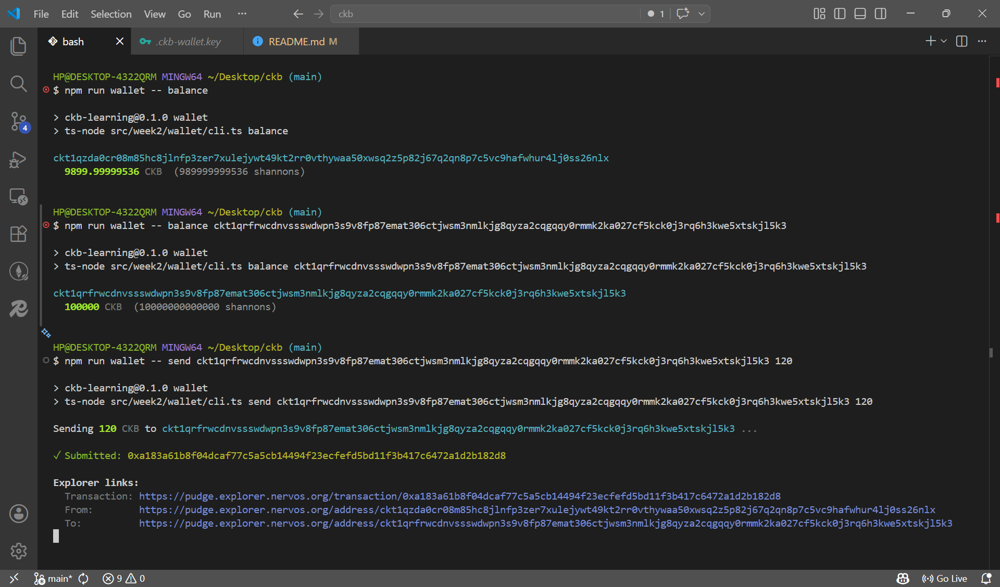

# Week 2: From Toy Chain to Real Testnet

This week I left the in-memory replica behind and made my first transactions
on the real CKB network — building a small CLI wallet against the Pudge
testnet using **CCC** (Common Chains Connector).

**Code:** [src/week2/wallet](../src/week2/wallet)

## Goal of the week

Stop modelling CKB and start *using* it. Specifically:

1. Generate and persist a real secp256k1 key.
2. Derive the recommended address from it.
3. Query my own balance and the balance of any other address from a public
   testnet RPC.
4. Build, sign, and broadcast a native CKB transfer that confirms in a real
   block and shows up on the explorer.

## Why CCC

The CKB ecosystem has three candidate TS/JS libraries:

- **Lumos** — mature but deprecated for new work.
- **ckb-sdk-js** — a low-level RPC client; lots of plumbing left to me.
- **CCC** — recommended modern SDK; opinionated, batteries included
  (signers, fee completion, change handling, address codec).

I went with CCC. Two import lines (`ccc.ClientPublicTestnet`,
`ccc.SignerCkbPrivateKey`) replace what would otherwise be a hundred lines
of cell collection and witness assembly.

## What I built

A four-command CLI:

```
npm run wallet -- init                        # generate + persist a testnet key
npm run wallet -- import <private-key>        # restore a wallet from an existing key
npm run wallet -- address                     # show my address
npm run wallet -- balance [address]           # mine, or anyone else's
npm run wallet -- send <to-address> <amount>  # transfer native CKB
```

```
src/week2/wallet/
├── client.ts   # CCC client + key persistence (.ckb-wallet.key, mode 0600)
├── wallet.ts   # getMyAddress / getBalanceOf / transfer + CKB↔shannon helpers
├── colors.ts   # tiny zero-dep ANSI colour helper (auto-disables on non-TTY)
└── cli.ts      # argv router + help text
```

The key file is gitignored, never leaves disk, and the CLI refuses to
overwrite an existing key — so a second `init` (or `import`) cannot
accidentally nuke a funded wallet. `import` accepts a key with or without
the `0x` prefix and only echoes a short fingerprint of it back, so it's
safer than `init` to run with someone watching the screen.

## What CCC actually does for you

The whole transfer flow is three calls:

```ts
const tx = ccc.Transaction.from({
  outputs: [{ lock: toLock, capacity: amount }],
});
await tx.completeInputsByCapacity(signer);  // pick live cells to fund the output
await tx.completeFeeBy(signer, feeRate);    // add change + pay miner fee
return await signer.sendTransaction(tx);    // sign with secp256k1 + broadcast
```

That hides four real pieces of work my Week 1 toy chain had to do by hand:

1. **UTXO selection** — `completeInputsByCapacity` enumerates my live cells
   and picks enough of them to cover the output.
2. **Change** — the difference between collected inputs and `output + fee`
   is automatically returned to my own lock as a new output cell.
3. **Fee** — `completeFeeBy(signer, 1000n)` sizes the fee at 1000
   shannons/kB based on the serialized transaction's actual size, not a
   guess.
4. **Witnesses** — `sendTransaction` produces the secp256k1 signature over
   the transaction's signing message and stuffs it into the witness slot
   for each input under my lock.

In Week 1 I implemented (toy versions of) the first, third and fourth
items by hand. Seeing them collapse to one chained call made me appreciate
why CCC is the recommended path.

## What I had to learn the hard way

### 1. The 61-CKB capacity floor

My first transfer:

```
$ npm run wallet -- send ckt1q...  10
Error: Client request error TransactionFailedToVerify:
  Verification failed Transaction(InsufficientCellCapacity(Outputs[0]):
  expected occupied capacity (0x16b969d00) <= capacity (0x3b9aca00))
```

`0x16b969d00` is **6.1 × 10⁹ shannons = 61 CKB**. Every cell on CKB has to
carry enough capacity to pay for *its own bytes on disk* — state rent, in
effect. The default secp256k1_blake160 lock with empty data costs 61 bytes,
so the minimum sendable amount is 61 CKB. Trying to send 10 means the
recipient's output cell can't afford its own existence.

Fix: send at least 61. I also added a client-side guard in `wallet.ts` so
the CLI catches this before the RPC round-trip:

```ts
if (amount < MIN_TRANSFER_SHANNONS) {
  throw new Error(`Amount too small: ... needs at least 61 CKB ...`);
}
```

This is the deepest connection back to Week 1 for me. The Cell Model says
*"a cell is a chunk of capacity guarded by scripts"*; capacity isn't
"balance" the way it is in account models, it's literally a reservation
of bytes. The 61-CKB floor isn't a limit in the protocol design — it's
the natural consequence of the model. You can't escape it without
changing what a cell *is*.

### 2. Testnet only

`ClientPublicTestnet` is hard-coded; the address codec uses HRP `ckt`.
This is on purpose — the same codebase can never accidentally touch
mainnet, even if I later forget which key I generated.

### 3. Output hygiene

Coloured output is nice during development but can wreck logs and pipes.
[colors.ts](../src/week2/wallet/colors.ts) auto-disables when
`process.stdout.isTTY` is false or when `NO_COLOR` is set. Zero
dependencies — pure ANSI escape codes.

## On-chain proof

After `send` succeeds the CLI prints three explorer links:

```
✓ Submitted: 0xabc…

Explorer links:
  Transaction: https://pudge.explorer.nervos.org/transaction/0xabc…
  From:        https://pudge.explorer.nervos.org/address/ckt1q…me…
  To:          https://pudge.explorer.nervos.org/address/ckt1q…recipient…
```

Here is the full `balance → balance <recipient> → send` flow against the
Pudge testnet:



The first link confirms the tx was accepted by the network and gives me
the block it landed in. The second and third let me eyeball both sides
of the transfer: my balance dropped by `100 + fee`, the recipient's
balance went up by `100`. That round-trip — local-built tx → public
node → block → explorer view — is the thing I came here to see.

## How it connects to Week 1

| Week 1 (toy)                                    | Week 2 (real)                                                         |
| ----------------------------------------------- | --------------------------------------------------------------------- |
| `Cell { capacity, lock, type?, data }`          | Same shape, validated by real CKB-VM running secp256k1 RISC-V binary. |
| `chain.submit(tx)` on an in-memory `Map`        | `signer.sendTransaction(tx)` to a Pudge RPC node → mempool → block.   |
| `lockFor("alice-secret")`                       | `secp256k1_blake160` Lock Script with my real public-key hash as `args`. |
| `cell(990n, bob, ...)` with hand-tuned capacity | `completeInputsByCapacity` + `completeFeeBy` automate it.             |
| Capacity conservation enforced by my code       | Enforced by every CKB node, with the 61-CKB floor making it concrete. |

Week 1 made the validation rules *legible*. Week 2 made them *binding*.

## What's next

Two ideas pulled from the project backlog that build naturally on this:

- **Cell explorer** — given an address, list its live cells with capacity
  and decoded data. Same CCC client, no signer needed.
- **Multi-sender transfer** — replicate the *Alice → Bob, Fred pays the
  fee* story from Week 1's demo, but on real testnet with two keypairs
  and two witnesses. The cleanest possible demonstration of CKB's
  flexible fee model.
