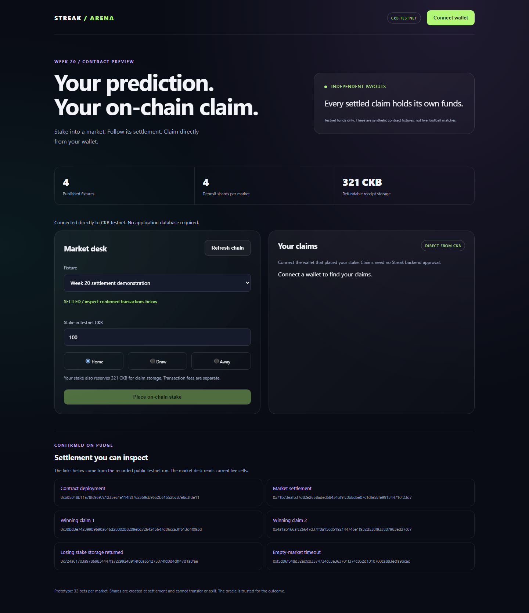
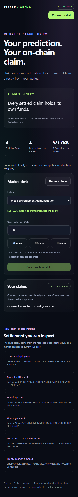
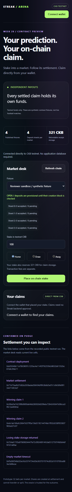

# Week 20: public testnet settlement and independent claims

Streak's Rust prototype now settles into independently funded claim cells. I deployed it to CKB Pudge testnet, funded three stakes, submitted an oracle result after the real kickoff, settled the market, and confirmed two winning claims with no shared inputs. The application backend and Neon were not involved in these transactions.

**Confirmed settlement transaction:**

[`0x71b73eafb37d82e2658aded58434bf9fc0b8d5e07c1dfe58fe991344710f23d7`](https://pudge.explorer.nervos.org/transaction/0x71b73eafb37d82e2658aded58434bf9fc0b8d5e07c1dfe58fe991344710f23d7)

This was a synthetic test fixture with an operator-reported outcome, not a football API result. The deployed Streak application still uses its existing custodial ledger. This week delivers a separate testnet contract demo, not a mainnet migration.

## What changed from Week 19

Week 19 accepted deposits across four shards but consolidated the money into one payout cell. Every claim then had to spend and replace that cell. Week 20 removes that redemption bottleneck.

Closure still consumes all four shards and verifies the complete accepted bet set. It now calculates each entitlement and puts the entire amount, plus receipt storage, into that bettor's claim cell. The remaining operator reserve is separate. Recovering it cannot affect unspent claims.

A claim transaction consumes its own funded cell and separate wallet fee inputs, then pays the exact full claim capacity to the pinned owner. It needs no market cell, shared counter, oracle signature or backend approval. Spending the same claim again is rejected by CKB.

Direct payments during settlement would require fewer transactions. I retained deferred claims here to provide a wallet claim and recovery workflow and demonstrate independent redemption. This is a deliberate interface choice, not a claim that direct payments are unsuitable.

## Public on-chain run

| Step | Confirmed transaction |
| --- | --- |
| Immutable Rust code deployment | [b05048b1...c3fde11](https://pudge.explorer.nervos.org/transaction/0xb05048b11a78fc9697c1235ec4e114f2f762559cb9652b61552bc87e8c3fde11) |
| Market creation | [7c63d1ec...dfb2fe8](https://pudge.explorer.nervos.org/transaction/0x7c63d1ecea9184896dae2ef8eb331813c84c1dab02c3188fb64aefc26dfb2fe8) |
| 100 CKB Home stake | [c88f0037...1922d6c](https://pudge.explorer.nervos.org/transaction/0xc88f0037931d608590bd75f5e636cb7672a4509d25b42ff1790e55ca81922d6c) |
| 300 CKB Home stake | [601c6632...1ac395](https://pudge.explorer.nervos.org/transaction/0x601c6632dfe7c709d45b9fa5158e675a204a4a62e0498f458a5c2fadf91ac395) |
| 200 CKB Draw stake | [9a9f8268...200088](https://pudge.explorer.nervos.org/transaction/0x9a9f82685231b6bc45cb34fd0b6bd8f7fa48d545edb6eb902c341030b7200088) |
| Oracle reports Home | [d7da3ba2...c1dcfd](https://pudge.explorer.nervos.org/transaction/0xd7da3ba21fa848671647ed1911974f8b06866ab51c66765f0b5ba48083c1dcfd) |
| Settlement funds all three claims | [71b73eaf...0f23d7](https://pudge.explorer.nervos.org/transaction/0x71b73eafb37d82e2658aded58434bf9fc0b8d5e07c1dfe58fe991344710f23d7) |
| Reserve recovered before claims | [25eb24b8...a0cc36](https://pudge.explorer.nervos.org/transaction/0x25eb24b806aeb19daa85b5e1d52b6f1d48d107cfadce543377d99b6d33a0cc36) |
| First winning claim | [30bd3e74...4f093d](https://pudge.explorer.nervos.org/transaction/0x30bd3e742399b9690a646d28002b8209ebc7264245647d06cca3ff613d4f093d) |
| Second winning claim | [4a1ab166...d27c07](https://pudge.explorer.nervos.org/transaction/0x4a1ab166afc26647d37ff0a156d5192144746e1f932d538f933807983ed27c07) |
| Losing receipt storage returned | [724a6170...1a8fae](https://pudge.explorer.nervos.org/transaction/0x724a61703a97869834447fa72c99248914fc0a651275074fd0d4dff47d1a8fae) |
| Expired empty-market cancellation | [f5d06f34...a9bcac](https://pudge.explorer.nervos.org/transaction/0xf5d06f348d32ecfcb3374734c83e363701f374c852d1010700ca883ecfa9bcac) |

Both winning transactions were submitted before the runner waited for either confirmation. Their input sets are disjoint. Each was confirmed by the public node, and the evidence generator independently re-read all 14 transactions in the primary run, including wallet funding and the expired fixture's creation. A broadcast hash alone is not treated as success.

The winning pool was 400 CKB and the losing pool 200 CKB. The protocol fee was 4 CKB and the creator fee 2 CKB, leaving 194 CKB profit for winners.

| Position | Principal | Betting payout | Returned storage | Claim output |
| --- | ---: | ---: | ---: | ---: |
| Home winner A | 100 CKB | 148.5 CKB | 321 CKB | 469.5 CKB |
| Home winner B | 300 CKB | 445.5 CKB | 321 CKB | 766.5 CKB |
| Draw loser | 200 CKB | 0 CKB | 321 CKB | 321 CKB |

These are the capacities of settlement outputs 1, 2 and 3. The winners receive principal plus their proportional profit. The losing receipt returns only storage. Network fees are paid from separate wallet inputs.

## Wallet demo and recovery

The new Arena screen connects a wallet, reads live contract cells, shows accepted and provisional shard records, builds stakes, and lists owner-bound claims. It includes the actual deployment, settlement and claim explorer links. The interface is labelled testnet and uses synthetic fixtures.

The browser and standalone recovery CLI share the same builders in `web/client.mjs`. They query CKB directly and pin the deployed protocol and guard hashes. The CLI accepts a claim outpoint and an owner key file, then builds and signs locally. It does not require a Streak session, server endpoint or Neon connection. Private keys are never served by the demo.

I also ran those exact shared builders against public testnet in a second market. A 100 CKB winning stake against 200 CKB of losing stakes received 294 CKB plus its 321 CKB storage. The shared builder rejected a second claim attempt after confirmation. Its [settlement](https://pudge.explorer.nervos.org/transaction/0x37b2217d842767a4bd98ddc5e82c2194e27fb8ac6d68b56834e4a300c49b2a5d) and [winning claim](https://pudge.explorer.nervos.org/transaction/0x755bfd02773fb85c98f40b29efcc8731183973bc36f90ed0a093e00e62a4b703) are recorded separately from the primary scenario.

Operator commands can create another fixture against the same deployment, report its outcome, settle it or void it after the six-hour timeout. Late-bettor refund lock scripts are recovered from the deposit transaction's input history, so an operator does not need a database record for that wallet.





Run `npm run demo:week20` and open http://127.0.0.1:4120. These screenshots are of the actual demo reading public CKB state. The completed example markets have deposits disabled. A fresh operator-created sandbox is needed to place a new stake.

A [reviewer sandbox](https://pudge.explorer.nervos.org/transaction/0xbedda214ac9d9349f67dff5315fc41e2e4fef82463c31db3517ca7c52504e568) is also published in the market selector. It has its own four live shards. Its cutoff is encoded in the committed deployment manifest; the operator command can create a fresh one after it expires.



## Validation and measurements

| Check | Result |
| --- | --- |
| Rust CKB-VM | 49 scenarios passed in 8 test functions |
| Signed local devnet | 21 checks passed |
| Routing and accounting | 4 tests passed, including 1,000 generated portfolios |
| Shared browser/CLI builder tests | 4 tests passed |
| Shared builders on public testnet | Deposits, settlement, winning claim, losing-storage return and replay rejection passed |
| Primary public testnet run | 14 confirmed transactions, independently re-read |
| Browser layouts | Desktop 1440 and mobile 390, live RPC reads, six explorer links, no horizontal overflow or page errors |
| Root TypeScript build | Passed |

The VM scenarios cover all-shard accounting, unauthorized changes, changed totals, fabricated or underfunded claims, wrong recipients, underpayments, type removal and reserve separation. The local devnet adds real signature validation, simultaneous claims, double-spend rejection, full timeout refunds, and refund-owner recovery without a local wallet registry. The maximum 32-claim settlement is checked in the VM.

Receipt storage fell from the previous 500 CKB allowance to the layout's exact 321 CKB. Maximum shard storage fell from 1,000 CKB to 610 CKB. The initial five-cell operator reserve is now 3,050 CKB. The type/script layout, byte counts and remaining subsidies are documented in the lab README.

Measured serialized transaction sizes in the primary public run were 937 bytes for a deposit, 2,610 bytes for settlement, and 586 bytes for each independent winning claim. The runner paid 0.005 CKB per transaction. The shared wallet builders use CCC's fee completion at 1,000 shannons/kB. These are separate from locked storage capacity.

Successful VM fixtures ranged from 56,843 to 713,588 cycles, with the upper end covering the maximum market. VM wallet locks are mocked; public and devnet transactions use real secp256k1 signatures. These results are not a production throughput benchmark.

## Timeout test scope

The six-hour contract rule is unchanged. The local devnet advances its mining clock and tests an accepted stake being refunded in full after timeout. The public testnet timeout uses an intentionally empty market created with an already-expired deadline. It verifies the real consensus timeout path and operator reward, but does not claim that an accepted public stake waited six hours before refunding.

## Remaining limits

There are still four deposit shards, a 32-bet bound, atomic closure and owner-bound positions minted at settlement. Deposits within one shard can conflict. The oracle remains trusted and has no dispute/correction mechanism. Fixture labels are demo metadata rather than an on-chain football registry. Wallet compatibility is bounded by the prototype's lock-argument size rule.

Public code cells are permanently available under an unspendable deployment lock, with no upgrade mechanism. No mainnet launch, audit, live football oracle integration or migration of the custodial application is claimed. Automated browser checks do not substitute for testing every wallet extension's approval dialog.

## Source and reproducibility

- [Contract, schema and commands](../src/week20/contract-lab/README.md)
- [Public transaction evidence](assets/week-20/testnet.json)
- [Shared builder public test](assets/week-20/client-testnet.json)
- [Local devnet evidence](assets/week-20/devnet.json)
- [VM output](assets/week-20/vm-tests.txt)
- [Accounting output](assets/week-20/accounting-tests.txt)
- [Summary](assets/week-20/summary.json)

```sh
npm run test:week20
npm run devnet:week20
npm run demo:week20
npm run evidence:week20
```

`npm run testnet:week20` creates a new deployment and spends testnet funds. The committed manifest reuses the completed deployment for normal demo and recovery use.
