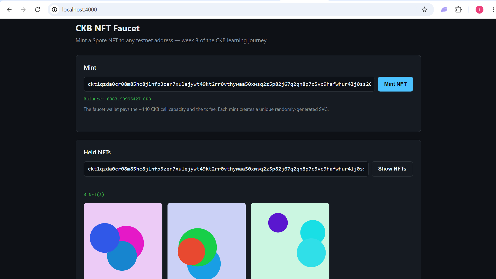

# Week 3: An NFT Faucet — Spores in a Browser

This week the CLI grew a face. I wrapped CCC's Spore module behind a tiny
HTTP API and a one-page UI that does two things and nothing else:

1. **Mint** a randomly-generated SVG NFT to any testnet address you paste in.
2. **List** the NFTs (Spores) currently held by any testnet address.

There is no wallet connect, no web3 modal, no signing in the browser. The
server-side faucet wallet — the same `.ckb-wallet.key` from week 2 — pays
the cell capacity and the fee, then ships ownership of the new Spore cell
to whoever's address you typed.

**Code:** [src/week3/nft-faucet](../src/week3/nft-faucet)

## Goal of the week

Stop reading about Spore / DOBs and actually mint one. Specifically:

1. Use the Spore type script to wrap arbitrary content (an SVG) in a CKB
   cell with a unique `sporeId`.
2. Build an end-to-end flow — *click → tx → block → render* — without
   pulling in a frontend framework or a wallet bridge.
3. Reuse week 2's signer plumbing instead of re-inventing it. The faucet
   should feel like a feature added to the wallet, not a separate app.

## What is a Spore?

A **Spore** is a CKB cell whose Type Script is the Spore protocol script
and whose `data` is a Molecule-packed `(contentType, content, clusterId?)`
tuple. Two properties make it the canonical NFT primitive on CKB:

- **`sporeId` is `hashTypeId(firstInput, outputIndex)`** — the same
  Type-ID trick used for upgradeable scripts. Because the first input's
  OutPoint is unique on-chain forever, the resulting `args` is unique
  forever. No central registry needed.
- **The content lives in the cell itself**, not behind an `ipfs://` URL.
  An SVG NFT minted on CKB is *fully on-chain*: when the cell is alive,
  the art exists; when it's burned, it's gone. The capacity you pay is
  literally the storage rent for those bytes.

That second property is why I went with an SVG instead of a `tokenURI`
pattern. A 600-byte SVG fits comfortably inside the cell and renders
straight from the on-chain data the explorer (or my own UI) reads back.

## The architecture

```
Browser ──fetch──▶ Node http server ──CCC──▶ Pudge testnet
   │                       │
   │                       ├── POST /api/mint   → createSpore + sendTx
   │                       └── GET  /api/nfts   → findSpores by lock
   ▼
index.html (vanilla JS, ~120 LOC)
```

```
src/week3/nft-faucet/
├── server.ts           # zero-dep Node http server + JSON API
├── spore.ts            # mint / list wrappers around @ckb-ccc/spore
├── art.ts              # deterministic SVG generator (sha256-seeded)
└── public/index.html   # one-file UI: input + button + grid
```

No Express, no Vite, no React. Node's built-in `http` module is enough for
two endpoints, and a single HTML file is enough for two forms. The
constraint is deliberate: in week 1 the goal was to make the protocol
legible; this week the goal is to make a dApp legible. Every line of the
faucet is something I had to choose to write.

## What CCC actually does for you (this time)

Mint, end to end:

```ts
const { tx, id } = await createSpore({
  signer,
  data: { contentType: "image/svg+xml", content: svgBytes },
  to: recipientLock,
});
await tx.completeFeeBy(signer, 1000n);
const txHash = await signer.sendTransaction(tx);
```

`createSpore` does four things I would otherwise have to do by hand:

1. **Pulls in the Spore script's `cellDeps`** so the on-chain Type Script
   can actually run when the tx is verified.
2. **Computes `sporeId = hashTypeId(firstInput, 0)`** and stuffs it into
   the new cell's `type.args`.
3. **Molecule-packs `SporeData`** into the cell's `data` field — the
   on-wire format the Spore script expects to unpack.
4. **Picks a funding input** (`completeInputsAtLeastOne`) so step 2 has
   something to hash against.

`completeFeeBy` then sizes the fee from the serialized tx and adds change
back to the faucet wallet. `sendTransaction` signs the secp256k1 inputs
and broadcasts.

Listing is even shorter:

```ts
for await (const found of findSpores({ client, lock, limit, order: "desc" })) {
  // found.sporeData.contentType, found.sporeData.content, ...
}
```

`findSpores` enumerates every Spore script's known deployment and
scans live cells whose lock matches the queried address — exactly the
"NFTs held by user X" query, expressed against the cell model directly
rather than against an event index.

## What I had to learn the hard way

### 1. NFTs aren't free — the recipient needs ~140 CKB of capacity

My first mint:

```
Error: Client request error TransactionFailedToVerify:
  Verification failed Transaction(InsufficientCellCapacity(Outputs[0]):
  expected occupied capacity (...) <= capacity (...))
```

A Spore cell carries: the secp256k1 lock (~33 bytes hashed), the Spore
type script (~33 bytes hashed + 32-byte args), the 8-byte capacity field,
*plus* the Molecule-packed `SporeData`. With even a tiny SVG payload that
adds up to roughly **140 CKB of minimum capacity** before any fee.

The week-2 lesson generalises: in the cell model, *every* on-chain
artifact pays for its own bytes. Tokens (sUDT/xUDT), DAO deposits, and
NFTs all sit on top of this same floor — the type script just adds its
own overhead on top of the lock script's 61-CKB baseline.

In the faucet I push the capacity onto the **server's** wallet via
`completeFeeBy(signer, ...)`. The recipient receives a Spore cell they
own (lock = their address) without spending a shannon themselves. That's
the "faucet" part: the model lets ownership and funding be separated
cleanly because they're separate fields on the cell.

### 2. SporeData fields aren't strings

`createSpore`'s `data.content` is a `BytesLike`, not a string. Passing a
JS string silently makes the on-chain payload look like UTF-16 garbage to
anything that decodes it. I encode explicitly:

```ts
const content =
  typeof payload.content === "string"
    ? new TextEncoder().encode(payload.content)
    : payload.content;
```

And on the way out, I use `ccc.bytesFrom(sporeData.content)` plus a
`TextDecoder` only when the `contentType` is text-ish (`text/*`,
`image/svg+xml`, `application/json`). Anything else stays as `0x...`
hex so the UI can still display *that* it's there even if it can't render
it.

### 3. The browser refuses to render an `` that contains a `<script>`

Because Spore content is arbitrary bytes, you should treat anything you
read out of a cell as untrusted. My first version rendered the SVG as
`innerHTML` directly, which is fine for *my* server-generated SVGs but
would be a stored-XSS hole the moment someone else mints to the same
address. Long-term I'd render it inside a sandboxed `<iframe srcdoc>`
or as a data-URI `` — both block scripts in the embedded SVG.

For week 3 I left the inline render in but flagged this as a real
follow-up. A user-input UI that displays user-input bytes from a public
chain is a classic XSS surface, and the cell model makes that explicit:
the chain stores what you give it, validation is your job at the edges.

### 4. ts-node, `__dirname`, and the static folder

`server.ts` resolves `public/` via `resolve(__dirname, "public")`.
Under `ts-node` that's `src/week3/nft-faucet/public` — exactly where the
HTML lives, so it just works during development. A future `tsc` build
would emit JS to `dist/` *without* the HTML (tsc only compiles `.ts`
files), so a real prod build would need a copy step. Out of scope for
week 3, but worth flagging for whoever (i.e. me) builds week 4 on top of
this.

## Running it

```bash
# 1. Make sure the week-2 wallet exists and is funded.
npm run wallet -- address          # (or `init` / `import` first)
npm run wallet -- balance          # need ~150 CKB per mint

# 2. Start the faucet.
npm run week3
# → NFT faucet running at http://localhost:4000
```

Open `http://localhost:4000`, paste any `ckt1...` address, hit **Mint
NFT**, then click **Show NFTs** to see the Spore in the recipient's
collection. Each card links to the originating tx on the Pudge explorer.



The screenshot above shows the faucet wallet's address pasted into both
fields: the live balance reads back from the testnet RPC under the Mint
input, and the **Held NFTs** grid renders three on-chain SVGs straight
out of their Spore cells' data — no IPFS, no off-chain metadata.

## How it connects to weeks 1–2

| Week 1                                    | Week 2                              | Week 3                                                    |
| ----------------------------------------- | ----------------------------------- | --------------------------------------------------------- |
| Cell with `lock` only                     | Cell with `lock`, secp256k1 sig     | Cell with `lock` + Spore `type` script + on-chain data    |
| Type script as a JS predicate             | (not used)                          | Type script as the Spore protocol's RISC-V binary         |
| `chain.submit(tx)` — in-memory            | `signer.sendTransaction(tx)`        | Same call, plus `createSpore` to assemble the tx          |
| Capacity = bytes (toy)                    | 61-CKB lock floor                   | ~140-CKB Spore floor (lock + type + data)                 |
| Fee paid by Fred (3rd party in the demo)  | Fee paid by sender                  | Fee + capacity paid by faucet, *ownership* given to user  |

Week 1 made the model legible. Week 2 made the model binding. Week 3 is
the first one where someone *else* (the recipient) can interact with
state I created — and the cell model handles that with no plumbing
beyond setting a different lock on the output.

## What's next

Two natural follow-ups:

- **Cluster support** — group all NFTs minted by this faucet under a
  single Spore Cluster cell, so the explorer shows them as a collection
  rather than orphan Spores.
- **Sandbox the SVG render** — switch the UI from `innerHTML` to
  `<iframe srcdoc>` so user-supplied content is safe to display. This is
  the prerequisite for ever letting a *user* (rather than the server)
  choose the mint payload.
