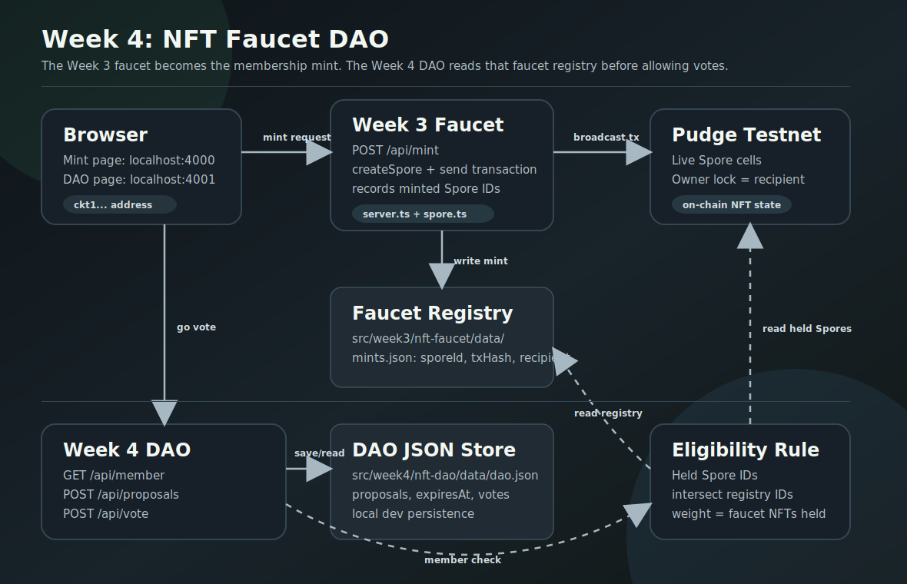
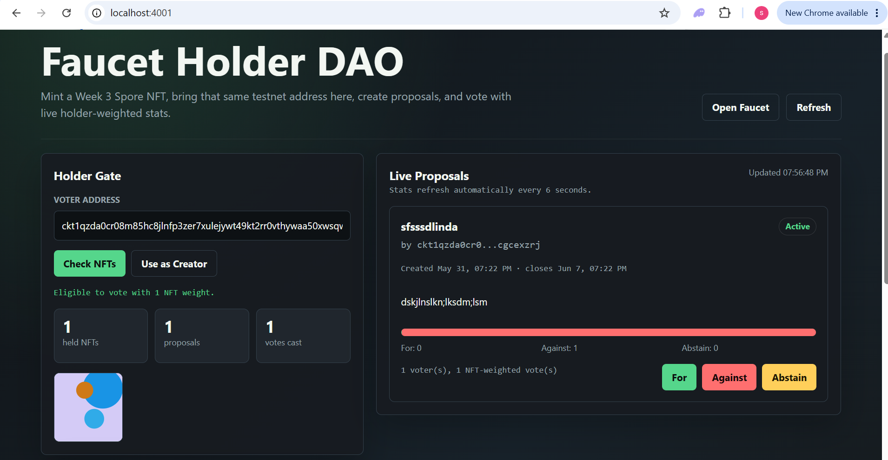
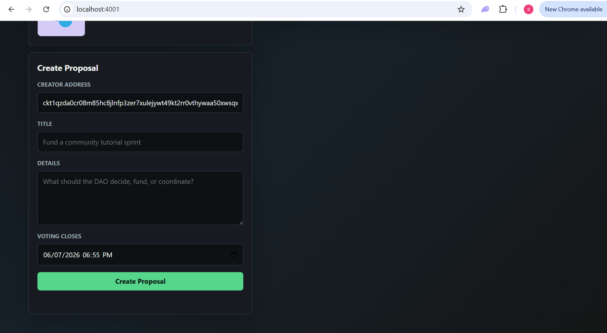

# Week 4: An NFT-Gated DAO

Week 4 turns the Week 3 faucet into a membership system. In Week 3, the
faucet minted Spore NFTs to any testnet address. In Week 4, those same NFTs
become DAO membership tokens: anyone can create proposals, but only addresses
that currently hold a faucet-minted NFT can vote.

The important shift is that the NFT is no longer just something to display.
It is now an access credential and a voting weight.

**Code:** [src/week4/nft-dao](../src/week4/nft-dao)  
**Extension point:** [src/week3/nft-faucet](../src/week3/nft-faucet)

## Goal of the week

Build a small DAO that proves a user can move from minting an NFT to using
that NFT as membership:

1. Mint a Spore NFT from the Week 3 faucet.
2. Bring the same `ckt1...` address into the DAO app.
3. Create proposals with expiration times.
4. Vote on active proposals only if the address currently holds a
   faucet-minted NFT.
5. Display live proposal stats in the browser.

This keeps the project intentionally small: no wallet connect, no database,
no frontend framework, and no on-chain DAO contract yet. The point is to
make the architecture legible before making it more decentralized.

## Architecture



Editable source: [week-4-architecture.drawio](./assets/week-4-architecture.drawio)

There are now two browser apps:

- **Week 3 faucet** at `http://localhost:4000`
- **Week 4 DAO** at `http://localhost:4001`

The DAO depends on the faucet in two ways:

1. The faucet mints the membership NFTs.
2. The faucet records which Spore IDs were minted by this project.

That second part matters. A raw Spore lookup can tell us which Spores an
address holds, but it cannot by itself tell us which Spores came from this
faucet. The DAO should not treat every random Spore on Pudge as DAO voting
power. So Week 4 checks both facts:

- Is this Spore currently held by the address?
- Is this Spore ID present in the faucet mint registry?

Only the intersection counts.

## Persistence

This project currently uses local JSON files for persistence.

### Faucet mint registry

When the faucet mints an NFT, it now writes a local record:

```txt
src/week3/nft-faucet/data/mints.json
```

Each entry stores:

- `sporeId`
- `txHash`
- `mintedTo`
- `mintedAt`

The actual NFT ownership still lives on-chain as a Spore cell on Pudge
testnet. The JSON file is only a project-local registry that answers:

> Was this Spore minted by this faucet?

This fixes a subtle bug in the first DAO draft. The DAO was originally using
the generic `listNfts(address)` helper, which returns Spores held by an
address. That was too broad. Now the DAO calls `listHeldFaucetNfts(address)`,
which reads the faucet registry, reads currently held Spores from the chain,
and returns only matching faucet NFTs.

### DAO proposal and vote store

Proposals and votes are stored here:

```txt
src/week4/nft-dao/data/dao.json
```

Each proposal includes:

- `id`
- `title`
- `body`
- `creatorAddress`
- `createdAt`
- `expiresAt`
- `votes`

Each vote includes:

- `address`
- `choice`: `for`, `against`, or `abstain`
- `sporeCount`
- `updatedAt`

The server writes JSON through a small queued write helper so concurrent
requests do not trample each other. It writes to a temporary file first, then
renames it into place.

Both data directories are gitignored because they are runtime state:

```txt
src/week3/nft-faucet/data/
src/week4/nft-dao/data/
```

## Proposal expiration

Proposals now have expiration times.

If the creator does not choose one, the server defaults to seven days after
creation. The browser UI exposes this as a `datetime-local` field called
**Voting closes**.

The server rejects invalid expiration values and rejects dates in the past.
When a proposal expires:

- The API returns its `status` as `expired`.
- The UI displays an `Expired` badge.
- Vote buttons are replaced with a closed-voting message.
- `POST /api/vote` returns an error instead of accepting late votes.

The expiration check happens on the server, not only in the UI. The UI is a
convenience; the server is the rule.

## Voting model

Voting is NFT-gated and NFT-weighted.

When a user submits a vote, the DAO server:

1. Validates the `ckt1...` address.
2. Reads faucet-minted Spore IDs from `mints.json`.
3. Uses the Week 3 Spore helper to list Spores currently held by that address.
4. Counts only held Spores whose IDs exist in the faucet registry.
5. Rejects the vote if the count is zero.
6. Records or updates the vote with `sporeCount` as the voting weight.

So if an address holds three faucet NFTs, its vote contributes weight `3`.
If it holds zero faucet NFTs, it cannot vote.

For this learning project, an address can update its vote on a proposal. The
stored vote is replaced with the latest choice and latest NFT weight.

## API surface

The Week 4 server exposes a small JSON API:

```txt
GET  /api/member?address=ckt1...
GET  /api/proposals
POST /api/proposals
POST /api/vote
```

`GET /api/member` is the membership gate. It returns:

```json
{
  "address": "ckt1...",
  "eligible": true,
  "count": 1,
  "nfts": []
}
```

`GET /api/proposals` returns proposal cards with live tally data:

```json
{
  "tally": {
    "for": 2,
    "against": 0,
    "abstain": 1
  },
  "total": 3,
  "status": "active"
}
```

`POST /api/proposals` accepts a title, body, optional creator address, and
expiration time.

`POST /api/vote` accepts a proposal ID, voter address, and choice. It performs
the NFT gate before writing the vote.

## How it extends Week 3

Week 3 answered:

> Can I mint and display a real on-chain NFT?

Week 4 answers:

> Can that NFT become useful inside an app?

The extension is deliberately direct:

- Week 3 already knows how to mint Spores.
- Week 3 already knows how to list Spores held by an address.
- Week 4 imports that listing logic instead of writing a new chain reader.
- Week 3 now records faucet-minted Spore IDs.
- Week 4 reads that registry to decide membership.

That makes the NFT faucet feel less like a demo endpoint and more like the
first stage of a DAO onboarding flow:

1. User mints membership NFT from the faucet.
2. User opens the DAO.
3. DAO checks that the NFT is still held by the address.
4. User votes with NFT-weighted power.

## Current trust model

This is still an off-chain DAO application.

The NFTs are real on-chain Spore cells, but the proposals and votes are local
JSON state. That means the app is useful for learning and demos, but it is
not yet a decentralized governance system.

The current trusted pieces are:

- The Node server controls the proposal/vote JSON file.
- The faucet registry is local to this project.
- There is no wallet signature proving that the address owner submitted the
  vote.

The membership check is stronger than before because it reads live on-chain
ownership, but vote authorship is still address-paste based. A production
version would require wallet signing.

## What I learned

### 1. A token gate needs provenance, not just ownership

Checking "does this address hold an NFT?" is too vague. On CKB, Spores are a
general NFT primitive. The DAO needs "does this address hold one of *our*
faucet NFTs?"

That is why the faucet registry exists.

### 2. Local JSON is fine for learning, but it defines the trust boundary

JSON persistence keeps the demo simple and inspectable. It also makes the
centralization obvious. The chain stores NFT ownership; the server stores DAO
state.

That split is a good teaching step because it highlights what must move
on-chain, or at least be signature-verified, in a more serious DAO.

### 3. Expiration belongs on the server

It is easy to hide vote buttons in the UI after a deadline. It is also not
enough. The server now rejects late votes, so expiration is part of the DAO
rule set instead of only presentation.

## Running it

Use two terminals:

```bash
# Terminal 1
npm run week3

# Terminal 2
npm run week4
```

Then open:

```txt
http://localhost:4000  # faucet
http://localhost:4001  # DAO
```

Flow:

1. Mint a faucet NFT to a testnet address.
2. Open the DAO.
3. Paste the same address into the holder gate.
4. Create a proposal with a voting deadline.
5. Vote on active proposals.

## Demo screens



The first screen shows the holder gate and proposal creation flow. The voter
address is checked against the faucet registry plus live on-chain Spore
ownership before it can vote.



The second screen shows live proposal cards with NFT-weighted tallies,
active/expired status, and vote actions for eligible faucet NFT holders.
