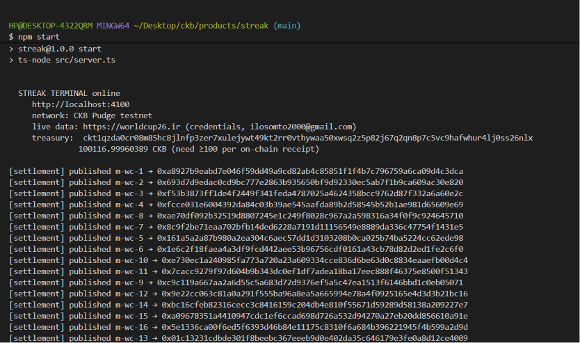
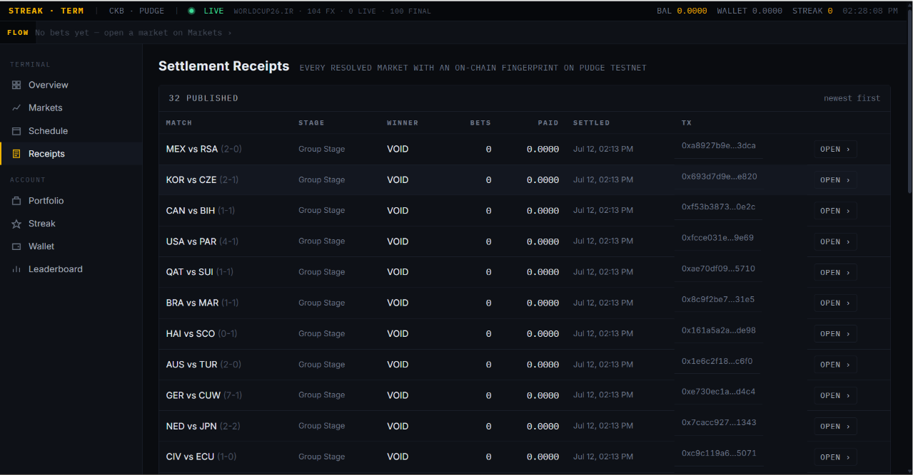
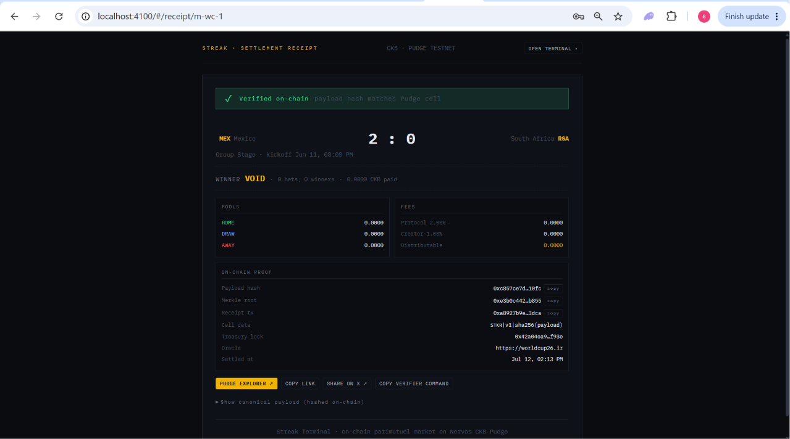

# Week 8: Streak Terminal — On-Chain Settlement Receipts

Week 6 built the parimutuel market engine and Week 7 grounded it in a real
CKB wallet + a live oracle. The one seam left was **trust in the settlement
step itself**: an outsider had to take the server's word that the numbers
displayed on the "Market resolved" screen were the numbers the engine actually
applied to escrow. In effect the settlements were trustless in code but not
verifiable outside the process running the code.

Week 8 closes that gap. Every resolved market now publishes a **receipt cell**
on Pudge, and three independent verifiers — the UI, the API, and a standalone
CLI — can prove that the settlement pinned on-chain is the same one served by
the API.

**Code:** [products/streak](../products/streak)
**Run:** `npm run streak` → [http://localhost:4100](http://localhost:4100)
**Verify:** `npm run verify -- <marketId>` (from `products/streak/`)

## Why not just publish the whole payload?

The natural first design was to encode the full settlement JSON into cell
data. That fails on testnet economics.

CKB's occupied-capacity rule requires **1 CKB per byte** of a cell (that's the
whole point of the model — data is paid rent through capacity). A realistic
receipt payload is ~700-1000 bytes, so a single receipt would need ~800 CKB of
capacity, and running the engine through the full tournament (~104 markets)
would freeze **over 80 000 CKB** in receipt cells. Not fatal on testnet but
uncomfortable, and worse: it puts a giant hidden cost on running a demo.

The right frame turned out to be **anchoring, not archiving**. The on-chain
cell needs only enough information to *authenticate* an off-chain payload —
that's a fixed 37 bytes (magic + version + 32-byte sha256), plus the standard
lock overhead — which drops the per-receipt capacity to ~98 CKB. The full
payload lives off-chain and is served by the API; anyone can recompute its
hash and check it against the cell.

```
┌── Off-chain (this DB / API) ───────────────────────────────────────┐
│ SettlementReceipt payload (canonical UTF-8 JSON)                   │
│ → served at /api/receipts/:marketId                                │
└─────────────────────┬──────────────────────────────────────────────┘
                      │ sha256(canonical bytes)
                      ▼
┌── On-chain (Pudge cell) ───────────────────────────────────────────┐
│ Lock:  treasury (only the treasury key can publish)                │
│ Type:  none                                                        │
│ Data:  magic "STKR" (4) | version (1) | sha256 (32) = 37 bytes     │
│ Cap :  100 CKB  (min ~98; = 8 + 53 lock + 37 data)                 │
└────────────────────────────────────────────────────────────────────┘
```

## Canonical encoding is the whole game

Verification only works if the publisher and the verifier produce **byte-identical**
canonical bytes for the same logical payload. A one-key reordering — the kind
`JSON.stringify` does by default — changes the sha256 and breaks every
inclusion proof.

[products/streak/src/settlement.ts](../products/streak/src/settlement.ts)
therefore ships its own `canonicalize()`: recursive, arrays preserved,
object keys sorted alphabetically at every level. It's the discipline that
lets the CLI in step 6 below match hashes against the server without ever
importing server code.

## Merkle root over the bet set

A hash-only receipt would let a stranger prove "this market settled as
declared", but not "my bet was part of that settled set". Adding a **merkle
root over every bet** into the payload closes that gap. Leaves are sorted by
`placedAt` (tie-broken on bet id, so publisher and verifier agree) and hashed
as `sha256({betId, userHash, outcome, amountShannons})`, where

$$
\text{userHash} = \text{sha256}(\text{userId} \,\|\, \text{":"} \,\|\, \text{marketId})
$$

The per-market user hash means a public receipt doesn't leak an activity
timeline — the same user across two different markets gets two unrelated
leaf hashes — while a bettor with their own userId can still prove ownership
of every bet they placed in a single market.

Inclusion proofs are the standard bottom-up walk (odd nodes duplicate
Bitcoin-style). The API endpoint that returns them
(`GET /api/receipts/:marketId/proof?bet=…`) rebuilds the tree from the
current bet set and returns both the freshly-computed root and the payload's
declared root, so a client can see straight away whether they still match.

## The publish loop

The receipt writer lives in
[products/streak/src/game.ts](../products/streak/src/game.ts) as
`publishPendingReceipts()`, hooked into the tail of `syncMatches()` (which
runs at boot and every 20 s). Three constraints shaped it:

1. **It must not block writes.** A CCC round-trip takes seconds; the DB
   write lock takes milliseconds. So it runs *after* the settlement
   transaction commits, snapshotting the outstanding work from a read.
2. **It must be idempotent.** A single in-flight publish is coalesced via a
   `publishing: Promise<void> | null` gate — later ticks just re-await it,
   so a slow chain call can't stack duplicate submissions.
3. **It must degrade gracefully.** Every receipt cell costs ~100 CKB of
   capacity plus ~0.0001 CKB in fee. If the treasury runs low, the market
   stays flagged unresolved-in-receipt-terms and retries silently on the
   next tick, logging a nudge at most once per hour so it stays visible
   without spamming the console.



## Three verifiers

The receipt is only useful to the degree an outsider can independently check
it. Streak exposes the same underlying check at three surfaces, in
descending trust:

**1. In the app.** The Market Detail page shows a green
`✓ VERIFIED ON-CHAIN` chip when the on-chain cell exists and its embedded
hash matches the current payload; a red chip if the check fails. A
click-through opens the public shareable page.

**2. Via the API.** `GET /api/receipts/:marketId` does a **fresh Pudge RPC
round-trip** every call, decodes the cell data, and returns
`{onChain: {ok, onChainPayloadHash, expectedPayloadHash, ...}}`. There is no
cache — the server itself doesn't get to lie about its own settlements.

**3. Standalone CLI.** `npm run verify -- <marketId>` is deliberately
minimal: it imports only `canonicalize`, `sha256`, and the cell-data
decoder, then talks to the API and to public CKB RPC directly. It doesn't
touch `db.json` or any server internals. It's the "anyone can run this
against your instance" surface.

```
$ npm run verify -- m-wc-6
Streak receipt verifier
  market         m-wc-6
  api base       http://localhost:4100

1. payload
  ✓ sha256(payload) matches server: 0x826a24379d57f1b7…

2. merkle root
  ✓ merkle root over live bet set matches payload

3. on-chain cell
  magic          STKR
  version        1
  ✓ on-chain hash matches computed payload hash

✓ verified — this receipt is authentically pinned on Pudge
  explorer: https://pudge.explorer.nervos.org/transaction/0x1e6c2f18faea4a3df9fcd442aee53b96756cdf0161a43cb78d82d2ed1fe2c6f0
```

## UI: gallery + shareable public receipts

Verification is only credible if it looks like something, so the UI got two
new surfaces this week:

- **Receipts gallery** at `#/receipts` — a chronological wall of every
  published settlement, with tx-hash cells and per-row Open buttons. Great
  for browsing history and quickly finding a receipt to demo.

  

- **Public receipt page** at `#/receipt/:marketId` — an unauthenticated,
  shareable, incognito-friendly page for any single settlement. Anyone
  with the URL can see the match card, the pool breakdown, the on-chain
  proof block, and — crucially — the exact **canonical JSON** that was
  hashed, tucked inside a `<details>`. There's a Copy verifier command
  button that pastes the exact `npm run verify -- <id>` command, so
  someone poking around can go from browser → their own terminal in one
  click.

  

Both pages copy the tx hash / payload hash / merkle root on click, and the
public page carries an X/Twitter intent URL with the summary pre-filled
alongside the permalink.

## Backfill and schema

Two safety pieces round the feature off.

**Boot backfill.** When the engine starts, any market resolved before the
receipts feature existed is queued for publishing immediately (in the same
loop as fresh settlements). This is idempotent — the persisted
`market.receipt` field is the sentinel — so a fresh clone that boots
against an already-drained treasury simply flags them pending and retries.

**Treasury override.** `getTreasury()` now respects a
`TREASURY_PRIVATE_KEY` env var. Without it, the engine auto-generates a
random treasury wallet on first boot; with it, the operator can point at a
wallet they've already funded from the Pudge faucet. This is what made the
smoke run credible: within the first minute of boot the engine published
**100 real Pudge transactions** back-to-back until the treasury reached
its ~100 CKB per-cell floor, at which point the "underfunded — X receipts
waiting" warning fired exactly once, as designed.

## What moved on-chain

The most concise way to see the week is a delta on Streak's trust surface:

| Piece                | Before               | After                                                    |
| -------------------- | -------------------- | -------------------------------------------------------- |
| Market outcome       | server DB row        | server DB row **+ signed sha256 in a Pudge cell**        |
| Bet inclusion        | server DB row        | server DB row **+ merkle proof against a Pudge cell**    |
| Oracle attribution   | UI badge             | UI badge **+ oracle field inside the hashed payload**    |
| Payload authenticity | trust the operator   | independent RPC round-trip; treasury lock proves author  |

## What this week proved

- On CKB, the "cell-as-rent" property forces a design conversation up
  front: publishing the full payload on-chain is honest but very
  expensive, and a fingerprint-plus-off-chain-payload split is often the
  right economic answer. The 20× capacity reduction (98 CKB vs ~800) is
  the whole reason the demo runs at all.
- Canonical serialization discipline pays back later. Making sure the
  publisher and the verifier produce byte-identical bytes is a boring
  refactor at write time and the difference between "trust me" and
  "verify yourself" at run time.
- Anchoring is more than a signature. A dedicated cell at the treasury
  lock ties the timestamp, the authorship, and the payload hash into one
  thing an outsider can look at without any special client.
- A working feature isn't credible until an outsider can prove it
  themselves. Building the verifier as its own executable, using only
  public interfaces (the HTTP API + CKB RPC), is what turns
  "settlements happen on-chain" from a claim into a demo.

## What's next

Two natural follow-ups line up on the trajectory already established:

- **Non-custodial custody.** The one caveat sitting under every previous
  report is that user keys live in `data/db.json`. With receipts in place
  as a public audit trail, migrating to a CCC signer/connector flow
  (JoyID / MetaMask via omnilock / UniSat) no longer removes the ability
  to prove settlement — every payout is still anchored to Pudge — so
  users can start bringing their own keys without losing verifiability.
- **A social layer over settlements.** With every settled market
  publicly linkable, the shared-experience piece (friend crews,
  head-to-head streaks, revive discounts when a friend picks the same
  match) has a concrete artefact to attach to.
