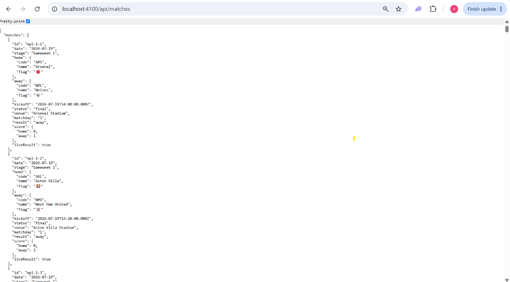
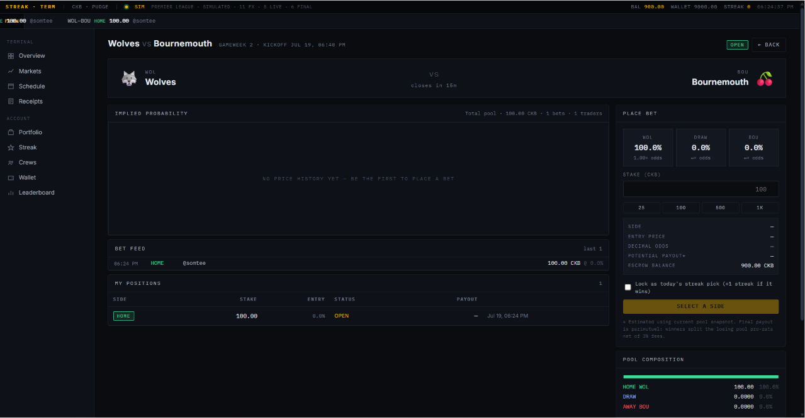
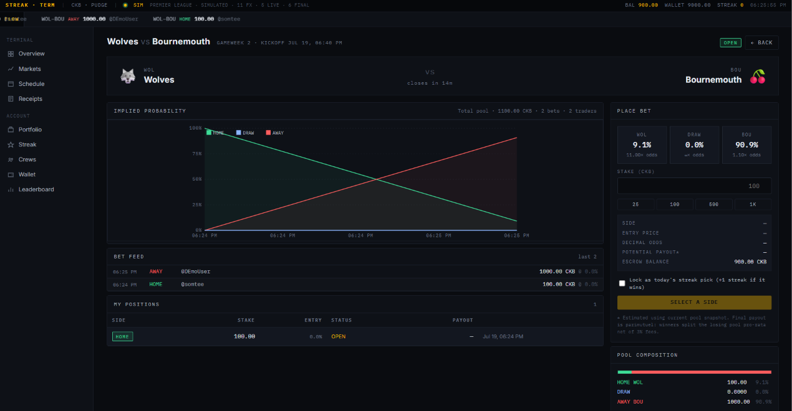
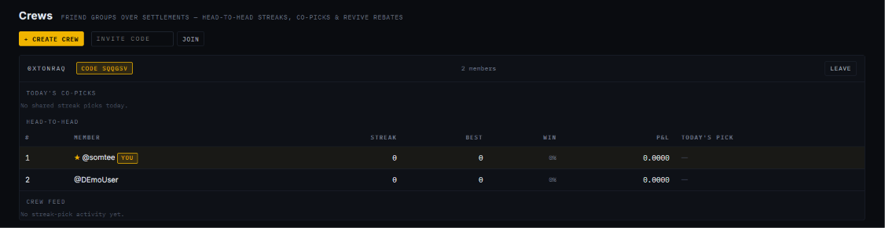
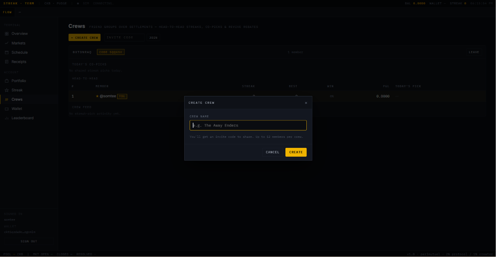
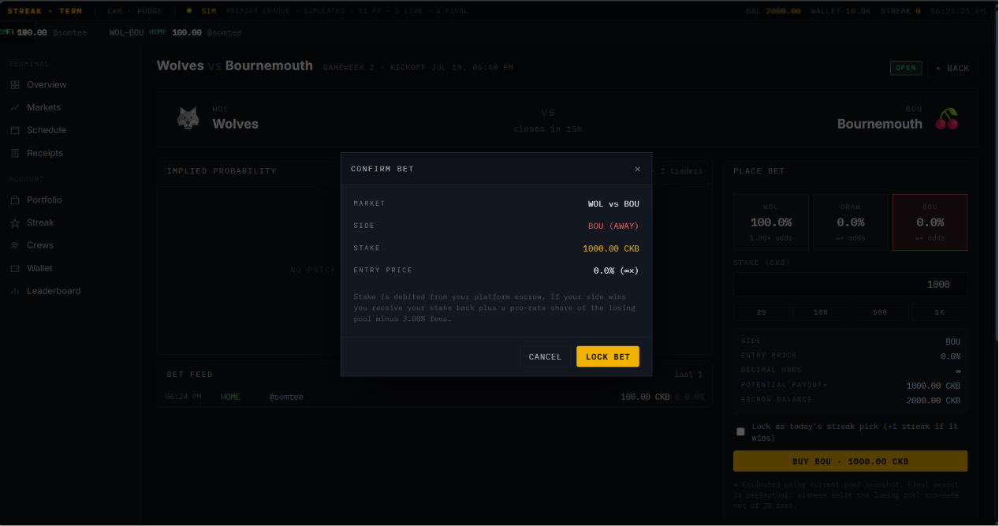

# Week 9: Streak Terminal — A Pluggable Oracle & a Social Layer

Week 8 closed the trust gap in settlement: every resolved market now publishes
a receipt cell on Pudge that anyone can verify. Two things were still true at
the end of it. First, the whole product was welded to a **single live feed** —
the worldcup26.ir oracle — which goes dark the moment the tournament ends (it
did, today). Second, every settled market was a **private** event: verifiable,
but not shared with anyone.

Week 9 fixes both. It pulls the data feed behind a pluggable interface (so the
engine can run on a simulator now and a Premier League feed next month without
touching a line of engine code), and it adds a **social layer** — crews,
head-to-head streaks, co-picks, and a revive rebate that pays you back when a
friend backed the same match.

**Code:** [products/streak](../products/streak)
**Run:** `MATCH_PROVIDER=dummy npm run streak` → [http://localhost:4100](http://localhost:4100)

## The problem with a hard-wired oracle

Weeks 6–8 grew organically around one data source. `wcdata.ts` loaded the WC
schedule from vendored JSON; `livescores.ts` polled worldcup26.ir for results;
`game.ts` called both directly. That was fine while the World Cup was live, but
it meant the app had exactly one testable state — *tournament in progress* —
and no way to reach it once the tournament was over. A demo you can't run is
not a demo.

The fix is a seam. Fixtures and results now flow through one interface,
[products/streak/src/providers/types.ts](../products/streak/src/providers/types.ts):

```ts
export interface MatchDataProvider {
  readonly id: string;
  init?(): Promise<void>;
  loadFixtures(): Match[];                              // sync — runs under the write lock
  fetchResults(): Promise<Record<string, LiveResult>>; // keyed by match id
  status(): Promise<ProviderStatus>;
}
```

The engine never names a specific API again; it only talks to a
`MatchDataProvider`, selected at boot by the `MATCH_PROVIDER` env var. The World
Cup path is now just one implementation
([providers/worldcup.ts](../products/streak/src/providers/worldcup.ts), a thin
adapter over the existing `wcdata` + `livescores`), and the whole registry is
five lines
([providers/index.ts](../products/streak/src/providers/index.ts)). When EPL
resumes, an `eplProvider` implementing the same four methods drops into that
registry and nothing else changes.

One design constraint shaped the interface: `loadFixtures()` is **synchronous**,
because the engine calls it from inside the store's write lock, where an
`await` would deadlock the mutation queue. Any async setup a provider needs
(auth handshakes, anchor persistence) goes in `init()`, which the server awaits
once at boot before the first sync.

## The dummy provider: a simulator that behaves like a live feed

[providers/dummy.ts](../products/streak/src/providers/dummy.ts) is the payoff.
It's a self-contained oracle that generates a real fixture list and drives it
on a wall clock, so the full lifecycle — `scheduled → live → final → on-chain
receipt` — happens on its own, any day of the year.

- **Fixtures**: 20 Premier League clubs, paired by the round-robin *circle
  method* into staggered gameweeks. (EPL clubs are a deliberate choice — the
  dummy doubles as the shape of the real feed it will be swapped for.)
- **A persisted anchor**: kickoff times hang off a base timestamp stored in the
  DB (`dummyAnchorIso`), so they survive restarts. The anchor defaults to *the
  start of the current hour minus two hours*, which means a handful of fixtures
  are already live or finished the instant you boot. When the whole schedule
  has elapsed, `init()` rolls a fresh anchor and drops the stale fixtures so the
  engine reseeds them — the simulator is self-healing and stays useful for
  weeks without a manual reset.
- **Deterministic results**: `fetchResults()` derives each fixture's state from
  the clock. Before kickoff it's absent (mirroring a real feed); in play it
  returns a running score whose goals accrue at seeded minutes; past full time
  it returns a final scoreline seeded by the match id — so every restart agrees
  on the same result.

The cleanest proof it's a real feed and not a mock is the raw endpoint. Every
`GET` on `/api/matches` is the simulator talking:



Note the `epl-*` ids, the `liveResult: true` flag, the club crests, and the
mix of `final` scorelines and (further down) `live` ones — all computed from
the current time, all keyed exactly like the real oracle so `applyResult()` in
[matches.ts](../products/streak/src/matches.ts) consumes them without knowing
which provider produced them.

## Same engine, a new league

Because the seam sits *below* the engine, everything built in weeks 6–8 — the
parimutuel pricing, the price-history chart, automatic settlement, on-chain
receipts — works unchanged on the simulated data. A market opens over a
simulated fixture the same way it always has — here Wolves vs Bournemouth, one
bet in, no price history yet:



…and once a second account trades into it, the implied-probability chart and
pool composition fill in exactly as on the World Cup build:



The status bar tells the whole story in one strip: `SIM · PREMIER LEAGUE ·
SIMULATED · 11 FX · 6 LIVE · 6 FINAL`. The provider swap is the only change;
the market engine, the escrow ledger, and the settlement path are identical to
the World Cup build.

## Crews: a social layer over settlements

The second half of the week attaches a social graph to the settlement data
already flowing through the system. A **crew**
([products/streak/src/crews.ts](../products/streak/src/crews.ts)) is a small
named group joined by invite code, and it's deliberately *a lens over existing
data* — there's no parallel ledger. It reads the same bets, streaks, and
markets the rest of the engine already maintains and reframes them three ways:



- **Head-to-head streaks** — members ranked live by current streak, best, win
  rate and P&L, with each member's locked pick for the day. The whole point of
  a streak is bragging rights; this is where they live.
- **Today's co-picks** — matches two or more crew-mates backed with a streak
  pick today, surfaced as chips (`ARS v WOL · HOME ×2`), so a crew can rally
  behind a fixture.
- **Crew feed** — a `PICKED / WON / LOST` activity stream over the members'
  streak picks.

Creating and joining is one modal and one code:



Ownership is handled gracefully: leaving hands the crew to the next member, and
the last one out deletes it — no orphaned empty crews. All of it is exposed
through four endpoints (`GET`/`POST /api/crews`, `POST /api/crews/join`,
`POST /api/crews/:id/leave`) that reuse the existing session auth.

## The revive rebate — and why it's a rebate, not a discount

The headline mechanic (flagged as "what's next" back in Week 8) is the **revive
rebate**: when a friend co-picked the match you just lost your streak on,
reviving costs you less. It's the moment the social layer touches real money.

The subtlety is *how* to make it cheaper. The obvious design — charge a smaller
on-chain renewal fee — runs straight into CKB's cell model. A renewal is a real
`wallet → treasury` transfer of `RENEW_FEE_CKB` (63 CKB), and that number sits
just above the **61 CKB cell-floor**: you cannot create an output cell smaller
than its occupied capacity, so there's simply no room to shrink the payment
on-chain.

So the rebate is credited to **escrow** instead. You pay the full 63 CKB
on-chain (the transfer stays valid and above the floor), and every crew-mate
who made a streak pick on that same match earns you 20 CKB back into escrow,
capped at 40. Crucially, the rebate is **fully backed** by the CKB the renewal
just paid in — the treasury nets `fee − rebate`, and no unbacked escrow is ever
minted. It's the honest way to express a discount when the unit economics won't
let you reduce the on-chain leg. The computation
(`reviveRebate()` in [crews.ts](../products/streak/src/crews.ts)) is a pure
function over the DB, so it runs identically inside the renewal mutation and in
the dashboard hint that previews the rebate before you commit.

Streak picks are locked from the market screen, the same tagged-bet flow the
rebate keys off:



## What this week proved

- **A seam is worth more than a feature.** The provider interface is ~70 lines
  and it converted the product from "only demonstrable during a specific
  three-week window" to "runnable forever, on any feed." The dummy provider is
  both the test harness and the template for the next real integration.
- **Synchronous constraints ripple.** `loadFixtures()` had to stay sync because
  it runs under the store's write lock — a reminder that the transaction
  boundary you chose weeks ago dictates the shape of interfaces you design
  later. The `init()` escape hatch is where all the async setup went.
- **The cell model keeps forcing honest economics.** Just as Week 8's
  receipts had to become fingerprints rather than archives (rent per byte),
  Week 9's discount had to become a rebate rather than a cheaper transfer (the
  cell-floor). CKB doesn't let you paper over the unit economics.
- **Social features are cheapest when they're a lens.** Crews add no new source
  of truth — they read the bets and streaks already on the ledger. That's why
  the whole layer is one module and four endpoints.
